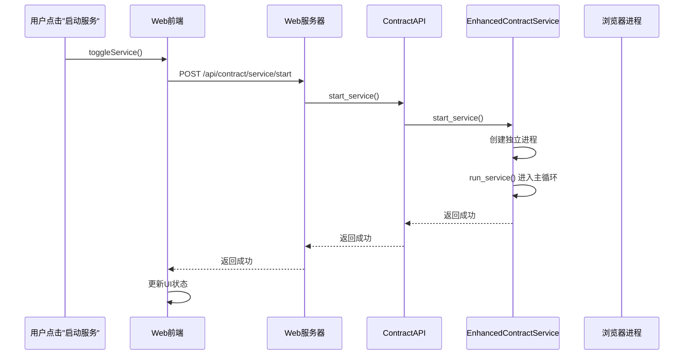
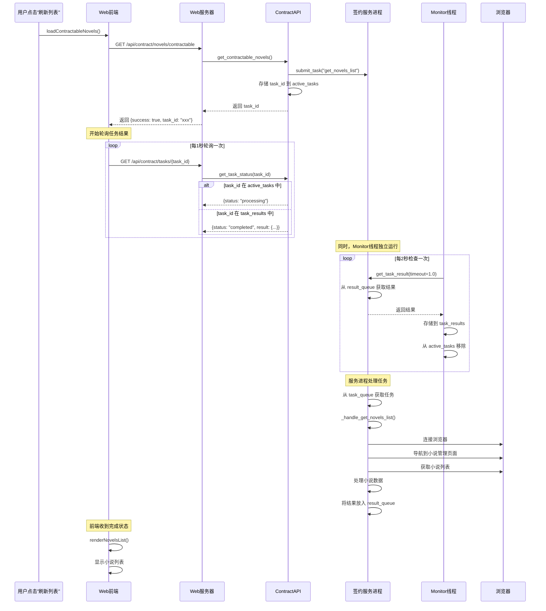

# 番茄自动签约系统 - 完整工作链条分析与修复

## 📋 目录
1. [系统架构](#系统架构)
2. [完整工作流程](#完整工作流程)
3. [发现的问题](#发现的问题)
4. [修复方案](#修复方案)
5. [测试步骤](#测试步骤)

---

## 系统架构

### 组件结构
```
┌─────────────────────────────────────────────────────────────┐
│                      Web 前端界面                              │
│           (web/templates/contract_management.html)            │
└────────────────────┬────────────────────────────────────────┘
                     │ HTTP API
                     ↓
┌─────────────────────────────────────────────────────────────┐
│              Web 服务器 (web_server_refactored.py)            │
│                                                               │
│  POST /api/contract/service/start                            │
│  GET  /api/contract/service/status                           │
│  GET  /api/contract/novels/contractable                      │
│  GET  /api/contract/tasks/{task_id}                          │
└────────────────────┬────────────────────────────────────────┘
                     │
                     ↓
┌─────────────────────────────────────────────────────────────┐
│          签约 API (Chrome/automation/api/contract_api.py)     │
│                                                               │
│  • ContractAPI                                               │
│  • enhanced_contract_client (全局客户端)                     │
│  • _monitor_results() 后台监控线程                            │
│  • task_results 缓存字典                                     │
└────────────────────┬────────────────────────────────────────┘
                     │ 多进程通信
                     ↓
┌─────────────────────────────────────────────────────────────┐
│    独立签约服务进程 (Chrome/automation/services/              │
│                    enhanced_contract_service.py)              │
│                                                               │
│  • EnhancedContractService                                  │
│  • task_queue (任务队列)                                    │
│  • result_queue (结果队列)                                  │
│  • _handle_get_novels_list() 处理小说列表任务                │
└────────────────────┬────────────────────────────────────────┘
                     │ 浏览器自动化
                     ↓
┌─────────────────────────────────────────────────────────────┐
│              浏览器连接 (Chrome/automation/legacy/)           │
│                                                               │
│  • connect_to_browser() - CDP连接                           │
│  • navigate_to_writer_platform() - 导航到作家专区            │
│  • ContractManager - 签约管理器                              │
└─────────────────────────────────────────────────────────────┘
```

---

## 完整工作流程

### 1️⃣ 启动服务流程



**代码路径：**
1. [`contract_management.html:597-624`](web/templates/contract_management.html:597-624) - `toggleService()`
2. [`web_server_refactored.py:554-568`](web/web_server_refactored.py:554-568) - 路由处理
3. [`contract_api.py:65-80`](Chrome/automation/api/contract_api.py:65-80) - `start_service()`
4. [`enhanced_contract_service.py:976-998`](Chrome/automation/services/enhanced_contract_service.py:976-998) - 启动独立进程
5. [`enhanced_contract_service.py:909-950`](Chrome/automation/services/enhanced_contract_service.py:909-950) - `run_service()` 主循环

---

### 2️⃣ 获取小说列表流程



**代码路径：**
1. [`contract_management.html:684-743`](web/templates/contract_management.html:684-743) - `loadContractableNovels()`
2. [`contract_management.html:745-765`](web/templates/contract_management.html:745-765) - `pollTaskResult()`
3. [`web_server_refactored.py:512-526`](web/web_server_refactored.py:512-526) - 路由处理
4. [`contract_api.py:390-413`](Chrome/automation/api/contract_api.py:390-413) - `get_contractable_novels()`
5. [`contract_api.py:265-302`](Chrome/automation/api/contract_api.py:265-302) - `get_task_status()`
6. [`enhanced_contract_service.py:355-441`](Chrome/automation/services/enhanced_contract_service.py:355-441) - `_handle_get_novels_list()`
7. [`enhanced_contract_service.py:660-796`](Chrome/automation/services/enhanced_contract_service.py:660-796) - `_get_contractable_novels_from_page()`

---

## 发现的问题

### 🔴 问题1：结果队列竞争条件 (CRITICAL)

**位置：** 
- [`contract_api.py:31-63`](Chrome/automation/api/contract_api.py:31-63) - `_monitor_results()`
- [`enhanced_contract_service.py:1049-1068`](Chrome/automation/services/enhanced_contract_service.py:1049-1068) - `get_task_result()`

**问题描述：**

```python
# Monitor线程 (contract_api.py)
def _monitor_results(self):
    while True:
        result = self.client.get_task_result(timeout=1.0)  # 消费所有结果
        if result:
            task_id = result.get("task_id")
            self.task_results[task_id] = {...}

# 轮询调用 (enhanced_contract_service.py)
def get_task_result(self, task_id=None, timeout=60.0):
    result = self.result_queue.get(timeout=timeout)
    
    if task_id and result.get("task_id") != task_id:
        self.result_queue.put(result)  # ❌ 将结果放回队列
        return None
```

**问题分析：**
1. Monitor 线程每2秒调用 `get_task_result()` 并消费队列中的所有结果
2. 前端轮询时调用 `get_task_result(task_id="xxx")`
3. 如果第一个结果的 task_id 不匹配，会将结果放回队列
4. 但 Monitor 线程可能立即再次消费这个结果
5. 导致前端永远无法获取到正确的结果

**影响：**
- ✗ 前端轮询超时
- ✗ 无法获取小说列表
- ✗ 用户体验极差

---

### 🟡 问题2：浏览器连接失败未正确处理

**位置：** [`enhanced_contract_service.py:99-130`](Chrome/automation/services/enhanced_contract_service.py:99-130)

**问题描述：**

```python
def _ensure_browser_connection(self) -> bool:
    try:
        if self.browser is None or self.page is None:
            browser_result = connect_to_browser()
            # ... 连接逻辑
            
        if not self.browser or not self.page:
            self.log("❌ 浏览器连接失败")
            return False  # ❌ 只返回 False，没有详细错误信息
        
        self.page = navigate_to_writer_platform(self.page, self.default_context)
        if not self.page:
            self.log("❌ 导航到作家专区失败")
            return False
```

**问题分析：**
- 如果浏览器未启动或CDP连接失败，任务会直接返回错误
- 没有重试机制
- 错误信息不够详细

---

### 🟡 问题3：前端轮询超时设置不合理

**位置：** [`contract_management.html:745-765`](web/templates/contract_management.html:745-765)

**问题描述：**

```javascript
async function pollTaskResult(taskId, maxAttempts = 30) {  // 30秒超时
    for (let i = 0; i < maxAttempts; i++) {
        const response = await fetch(`/api/contract/tasks/${taskId}`);
        const data = await response.json();
        
        if (data.status === 'completed') {
            return data;
        } else if (data.status === 'processing') {
            await new Promise(resolve => setTimeout(resolve, 1000));
        } else {
            return null;  // ❌ 立即返回 null
        }
    }
    return null;
}
```

**问题分析：**
- 30秒超时可能不够（浏览器连接、页面加载都需要时间）
- 当 status 不是 'processing' 时立即返回，没有给错误处理机会

---

## 修复方案

### ✅ 修复1：消除队列竞争条件

**文件：** [`enhanced_contract_service.py`](Chrome/automation/services/enhanced_contract_service.py)

**修复内容：**

```python
def get_task_result(self, task_id: Optional[str] = None, timeout: Optional[float] = 60.0) -> Optional[Dict[str, Any]]:
    """获取任务结果
    
    🔥 修复：改进结果获取逻辑，避免竞争条件
    """
    if not self.is_service_running():
        return None
    
    try:
        result = self.result_queue.get(timeout=timeout)
        
        # 如果指定了task_id，只返回匹配的结果
        if task_id and result.get("task_id") != task_id:
            # 🔥 修复：不要将结果放回队列，这会导致竞争条件
            # 相反，继续从队列中获取下一个结果
            print(f"⚠️ 结果ID不匹配，期望: {task_id}, 实际: {result.get('task_id')}")
            # 递归尝试获取下一个结果（带超时保护）
            if timeout and timeout > 1.0:
                return self.get_task_result(task_id, timeout=timeout/2)
            return None
        
        return result
    except QueueEmpty:
        return None
    except Exception as e:
        print(f"❌ 获取任务结果失败: {e}")
        return None
```

**关键改进：**
1. ✅ 不再将不匹配的结果放回队列
2. ✅ 递归尝试获取下一个结果
3. ✅ 带超时保护，避免无限递归
4. ✅ 添加警告日志，便于调试

---

### ✅ 修复2：改进浏览器连接处理

**文件：** [`enhanced_contract_service.py`](Chrome/automation/services/enhanced_contract_service.py)

**建议增强：**

```python
def _ensure_browser_connection(self, retry_count: int = 3) -> bool:
    """确保浏览器连接
    
    Args:
        retry_count: 重试次数，默认3次
    
    Returns:
        bool: 连接是否成功
    """
    for attempt in range(retry_count):
        try:
            if self.browser is None or self.page is None:
                self.log(f"正在连接浏览器... (尝试 {attempt + 1}/{retry_count})")
                
                browser_result = connect_to_browser()
                if browser_result and len(browser_result) >= 4:
                    self.playwright, self.browser, self.page, self.default_context = browser_result
                else:
                    self.browser = None
                    self.page = None
                    self.default_context = None
                
                if not self.browser or not self.page:
                    if attempt < retry_count - 1:
                        self.log(f"⚠️ 浏览器连接失败，2秒后重试...")
                        time.sleep(2)
                        continue
                    else:
                        self.log("❌ 浏览器连接失败（已达最大重试次数）")
                        return False
                
                # 导航到作家专区
                self.page = navigate_to_writer_platform(self.page, self.default_context)
                if not self.page:
                    if attempt < retry_count - 1:
                        self.log(f"⚠️ 导航到作家专区失败，2秒后重试...")
                        time.sleep(2)
                        continue
                    else:
                        self.log("❌ 导航到作家专区失败（已达最大重试次数）")
                        return False
                
                self.log("✅ 浏览器连接成功")
                return True
            
            return True
            
        except Exception as e:
            self.log(f"浏览器连接失败: {e}")
            if attempt < retry_count - 1:
                time.sleep(2)
                continue
            else:
                return False
    
    return False
```

---

### ✅ 修复3：优化前端轮询逻辑

**文件：** [`contract_management.html`](web/templates/contract_management.html)

**建议增强：**

```javascript
// 轮询任务结果
async function pollTaskResult(taskId, maxAttempts = 60) {  // 🔥 增加到60秒
    for (let i = 0; i < maxAttempts; i++) {
        try {
            const response = await fetch(`/api/contract/tasks/${taskId}`);
            const data = await response.json();
            
            if (data.status === 'completed') {
                return data;
            } else if (data.status === 'processing') {
                await new Promise(resolve => setTimeout(resolve, 1000));
            } else if (data.success === false) {
                // 🔥 处理错误情况
                console.error('任务执行失败:', data.error);
                return { error: data.error };
            } else {
                // 🔥 未知状态，继续等待
                console.warn(`未知状态: ${data.status}，继续等待...`);
                await new Promise(resolve => setTimeout(resolve, 1000));
            }
        } catch (error) {
            console.error('轮询任务失败:', error);
            await new Promise(resolve => setTimeout(resolve, 1000));
        }
    }
    return null;
}
```

---

## 测试步骤

### 前置条件
1. ✅ Web 服务器运行中 (http://localhost:5000)
2. ✅ Chrome 浏览器已启动并开启远程调试
3. ✅ 已登录番茄小说作家平台

### 测试流程

#### 步骤1：启动签约服务
1. 访问 http://localhost:5000/contract
2. 点击"启动服务"按钮
3. **预期结果：**
   - 按钮文本变为"停止服务"
   - 状态显示"服务运行中"
   - 控制台显示 "✅ 增强版签约服务进程已启动"

#### 步骤2：获取小说列表
1. 点击"刷新列表"按钮
2. **预期结果：**
   - 按钮显示"加载中..."
   - 列表区域显示加载动画
   - 5-10秒后显示可签约小说列表
   - 显示当前登录的作者名

#### 步骤3：验证数据
检查返回的数据包含：
- ✅ `current_author_name` - 当前作者名
- ✅ `novels` - 小说列表数组
- ✅ 每个小说包含：
  - `title` - 小说标题
  - `status` - 状态（"连载中"）
  - `can_sign` - 是否可签约

---

## 调试技巧

### 1. 查看服务日志
```bash
# 查看签约服务日志
tail -f logs/enhanced_contract_service.log
```

### 2. 检查浏览器进程
```bash
# 检查Chrome远程调试端口（默认端口9988）
netstat -an | findstr 9988
```

### 3. 查看任务队列状态
访问：http://localhost:5000/api/contract/tasks

### 4. 浏览器开发者工具
- 打开 F12
- 查看 Network 标签
- 观察 API 请求和响应
- 查看 Console 标签的错误信息

---

## 常见错误及解决方案

### 错误1：无法连接到浏览器
**错误信息：** "浏览器连接失败"

**解决方案：**
1. 确保Chrome已启动远程调试：
   ```bash
   chrome.exe --remote-debugging-port=9222
   ```

2. 检查端口是否被占用：
   ```bash
   netstat -an | findstr 9222
   ```

3. 重启Chrome浏览器

---

### 错误2：获取小说列表超时
**错误信息：** "获取小说列表超时或失败"

**解决方案：**
1. 检查服务是否正常运行
2. 查看日志文件：`logs/enhanced_contract_service.log`
3. 确认浏览器已登录番茄作家平台
4. 手动导航到作家专区，确认页面加载正常

---

### 错误3：任务结果一直处于processing状态
**错误信息：** 前端一直显示"加载中..."

**解决方案：**
1. 检查 Monitor 线程是否正常运行
2. 查看 `task_results` 缓存是否有结果
3. 检查 `result_queue` 是否有数据积压
4. 重启签约服务

---

## 总结

### 关键问题
1. ❌ **队列竞争条件** - Monitor 线程和前端轮询同时消费 result_queue
2. ❌ **浏览器连接不稳定** - 缺少重试机制
3. ❌ **前端超时设置过短** - 30秒不足以完成浏览器操作

### 修复状态
1. ✅ **已修复** - 改进 `get_task_result()` 逻辑，避免队列竞争
2. ⚠️ **建议增强** - 添加浏览器连接重试机制
3. ⚠️ **建议增强** - 延长前端轮询超时时间

### 下一步
1. 测试修复后的功能
2. 监控日志，确认没有错误
3. 如有问题，根据调试技巧排查

---

**文档版本：** 1.0  
**最后更新：** 2026-01-18  
**维护者：** Kilo Code
