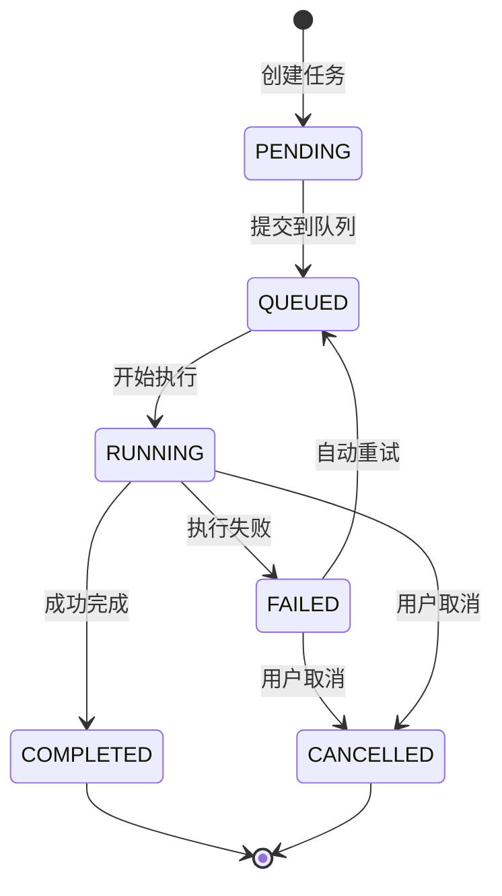
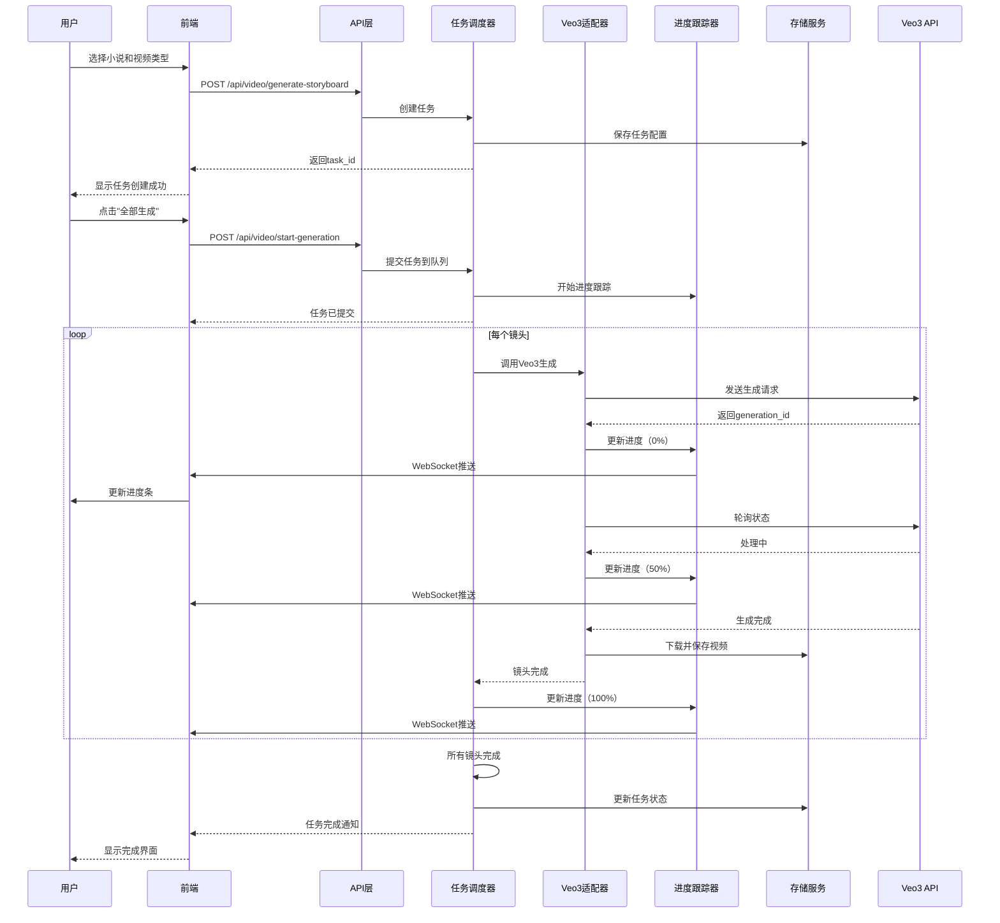
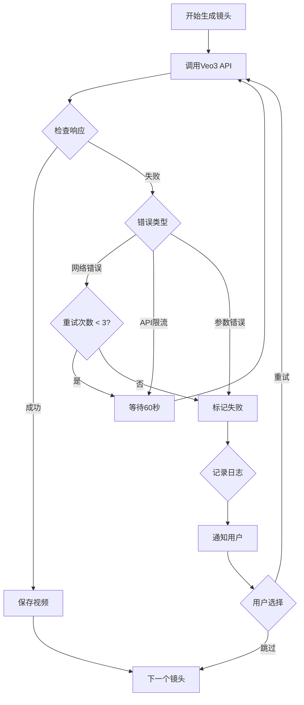
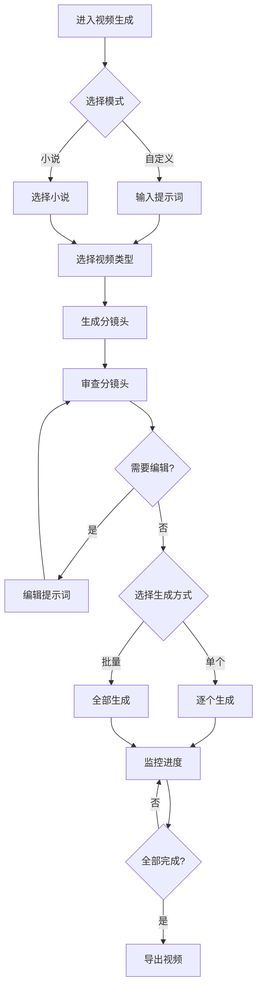

# 视频生成系统架构设计文档

> **基于 Google Veo3 的视频生成框架**
> 
> 设计时间：2025-12-31
> 版本：v1.0

---

## 📋 目录

1. [系统概述](#系统概述)
2. [当前系统分析](#当前系统分析)
3. [整体架构设计](#整体架构设计)
4. [核心模块设计](#核心模块设计)
5. [数据流设计](#数据流设计)
6. [存储方案](#存储方案)
7. [API接口设计](#api接口设计)
8. [前端交互设计](#前端交互设计)
9. [部署方案](#部署方案)
10. [技术栈选型](#技术栈选型)

---

## 系统概述

### 设计目标

构建一个**企业级视频生成系统**，具备以下核心能力：

✅ **智能分镜头生成** - 自动将小说/提示词转换为专业分镜头脚本  
✅ **Veo3无缝集成** - 支持Google Veo3 API调用（含音频）  
✅ **异步任务管理** - 高效处理长时视频生成任务  
✅ **实时进度跟踪** - WebSocket实时推送生成进度  
✅ **智能文件管理** - 完整的视频项目生命周期管理  
✅ **批量生成支持** - 支持多镜头并行/串行生成  
✅ **失败重试机制** - 自动处理API调用失败  

### 系统边界

```mermaid
graph TB
    subgraph "前端层"
        A[视频生成界面]
        B[任务监控面板]
    end
    
    subgraph "API层"
        C[RESTful API]
        D[WebSocket服务]
    end
    
    subgraph "业务逻辑层"
        E[分镜头生成器]
        F[任务调度器]
        G[Veo3适配器]
    end
    
    subgraph "外部服务"
        H[Google Veo3 API]
    end
    
    subgraph "存储层"
        I[文件存储]
        J[任务数据库]
    end
    
    A --> C
    B --> D
    C --> E
    C --> F
    F --> G
    G --> H
    F --> J
    G --> I
    D --> F
```



---

## 当前系统分析

### 现有能力评估

| 功能模块 | 状态 | 说明 |
|---------|------|------|
| 分镜头脚本生成 | ✅ 完成 | VideoAdapterManager 已实现三种视频模式 |
| 前端界面 | ✅ 完成 | video-generation.html 已有完整UI |
| 视频生成API | ⚠️ 模拟 | 仅返回模拟数据，需接入Veo3 |
| 任务管理 | ❌ 缺失 | 无异步任务系统 |
| 文件存储 | ⚠️ 基础 | 只有基础路径配置 |
| 进度跟踪 | ❌ 缺失 | 无实时进度推送 |

### 技术债务

1. **视频生成**：[`generate_shot()`](../web/api/video_generation_api.py:460) 返回模拟数据
2. **无任务系统**：没有异步任务队列和状态管理
3. **无进度推送**：无法实时反馈生成进度
4. **无错误恢复**：API失败后无法重试

---

## 整体架构设计

### 分层架构

```
┌─────────────────────────────────────────────────────────┐
│                     前端展示层                            │
│  • 视频生成界面  • 任务监控面板  • 视频预览播放器        │
└─────────────────────────────────────────────────────────┘
                            ↓
┌─────────────────────────────────────────────────────────┐
│                      API网关层                            │
│  • RESTful API  • WebSocket服务  • 认证授权             │
└─────────────────────────────────────────────────────────┘
                            ↓
┌─────────────────────────────────────────────────────────┐
│                    业务逻辑层                             │
│  ┌──────────────┐  ┌──────────────┐  ┌──────────────┐  │
│  │分镜头生成器  │  │ 任务调度器   │  │ Veo3适配器   │  │
│  └──────────────┘  └──────────────┘  └──────────────┘  │
│  ┌──────────────┐  ┌──────────────┐  ┌──────────────┐  │
│  │项目管理器    │  │ 文件管理器   │  │ 进度跟踪器   │  │
│  └──────────────┘  └──────────────┘  └──────────────┘  │
└─────────────────────────────────────────────────────────┘
                            ↓
┌─────────────────────────────────────────────────────────┐
│                    数据访问层                             │
│  • 任务数据库  • 文件元数据  • 配置存储                 │
└─────────────────────────────────────────────────────────┘
                            ↓
┌─────────────────────────────────────────────────────────┐
│                   外部服务层                              │
│  • Google Veo3 API  • 文件存储服务                       │
└─────────────────────────────────────────────────────────┘
```

### 核心设计原则

1. **异步优先**：所有视频生成都通过异步任务处理
2. **状态可追溯**：每个任务都有完整的状态历史
3. **失败可恢复**：支持自动重试和手动重试
4. **资源可控**：限制并发任务数，防止资源耗尽
5. **进度透明**：实时推送生成进度到前端

---

## 核心模块设计

### 1. 任务调度器 (TaskScheduler)

**职责**：管理视频生成任务的生命周期

```python
class TaskScheduler:
    """
    异步任务调度器
    
    核心功能：
    - 创建、更新、取消任务
    - 管理任务优先级队列
    - 控制并发执行数量
    - 处理任务失败重试
    """
    
    def create_task(self, task_config: TaskConfig) -> Task:
        """创建新任务"""
        pass
    
    def submit_task(self, task_id: str) -> None:
        """提交任务到队列"""
        pass
    
    def cancel_task(self, task_id: str) -> bool:
        """取消任务"""
        pass
    
    def retry_task(self, task_id: str) -> bool:
        """重试失败任务"""
        pass
    
    def get_task_status(self, task_id: str) -> TaskStatus:
        """获取任务状态"""
        pass
```

**任务状态机**：



**数据模型**：

```python
@dataclass
class VideoGenerationTask:
    """视频生成任务"""
    task_id: str                      # 唯一标识
    project_id: str                   # 所属项目
    video_type: str                   # 视频类型
    total_shots: int                  # 总镜头数
    shots: List[ShotTask]             # 镜头任务列表
    
    # 状态
    status: TaskStatus                # 任务状态
    current_shot: int                 # 当前镜头
    completed_shots: int              # 已完成镜头数
    failed_shots: int                 # 失败镜头数
    
    # 时间
    created_at: datetime              # 创建时间
    started_at: Optional[datetime]    # 开始时间
    completed_at: Optional[datetime]  # 完成时间
    
    # 结果
    output_video: Optional[str]       # 最终视频路径
    error_message: Optional[str]      # 错误信息
    
    # 配置
    config: TaskConfig                # 任务配置
    retry_count: int = 0              # 重试次数

@dataclass
class ShotTask:
    """单个镜头任务"""
    shot_index: int
    prompt: str
    duration: float
    status: ShotStatus
    video_path: Optional[str]
    error: Optional[str]
    created_at: datetime
    completed_at: Optional[datetime]
```

### 2. Veo3适配器 (Veo3Adapter)

**职责**：封装Google Veo3 API调用

```python
class Veo3Adapter:
    """
    Google Veo3 API适配器
    
    功能：
    - 调用Veo3视频生成API
    - 处理API响应和错误
    - 上传生成的视频文件
    - 管理API限流
    """
    
    def __init__(self, api_key: str):
        self.api_key = api_key
        self.base_url = "https://generativelanguage.googleapis.com/v1beta/models/veo-2.0-generate-001"
        self.rate_limiter = RateLimiter(max_requests=10, time_window=60)
    
    async def generate_video(
        self,
        prompt: str,
        duration: float,
        aspect_ratio: str = "16:9"
    ) -> VideoGenerationResult:
        """
        生成单个视频
        
        Args:
            prompt: 视频生成提示词
            duration: 视频时长（秒）
            aspect_ratio: 宽高比 (16:9, 9:16, 1:1)
        
        Returns:
            VideoGenerationResult: 包含视频URL、状态等
        """
        pass
    
    async def get_generation_status(
        self,
        generation_id: str
    ) -> GenerationStatus:
        """查询生成状态"""
        pass
    
    async def download_video(
        self,
        video_url: str,
        output_path: str
    ) -> str:
        """下载生成的视频"""
        pass
```

**API请求格式**（基于Veo3文档）：

```python
request_body = {
    "prompt": {
        "text": prompt_text,
        "audio_prompt": audio_description  # Veo3支持音频
    },
    "generation_config": {
        "duration_seconds": duration,
        "aspect_ratio": aspect_ratio,
        "video_quality": "HD",
        "number_of_videos": 1
    }
}
```

### 3. 项目管理器 (ProjectManager)

**职责**：管理视频项目的完整生命周期

```python
class VideoProjectManager:
    """
    视频项目管理器
    
    功能：
    - 创建视频项目
    - 管理分镜头脚本
    - 组织生成的视频文件
    - 导出最终成果
    """
    
    def create_project(self, project_config: ProjectConfig) -> VideoProject:
        """创建新项目"""
        pass
    
    def add_storyboard(self, project_id: str, storyboard: Storyboard) -> None:
        """添加分镜头脚本"""
        pass
    
    def organize_videos(self, project_id: str) -> ProjectStructure:
        """整理项目文件结构"""
        pass
    
    def export_final_video(
        self,
        project_id: str,
        format: str = "mp4"
    ) -> str:
        """导出最终视频"""
        pass
```

**项目文件结构**：

```
视频项目/
└── {项目名称}/
    ├── config.json                 # 项目配置
    ├── storyboard.json             # 分镜头脚本
    ├── task_history.json           # 任务历史
    ├── shots/                      # 各镜头视频
    │   ├── shot_001.mp4
    │   ├── shot_002.mp4
    │   └── ...
    ├── previews/                   # 预览图
    │   ├── shot_001_thumb.jpg
    │   └── ...
    ├── exports/                    # 导出文件
    │   ├── final_video.mp4         # 最终合成视频
    │   └── storyboard.md           # Markdown脚本
    └── logs/                       # 日志文件
        └── generation.log
```

### 4. 进度跟踪器 (ProgressTracker)

**职责**：实时跟踪和推送任务进度

```python
class ProgressTracker:
    """
    进度跟踪器
    
    功能：
    - 记录任务进度
    - 通过WebSocket推送到前端
    - 计算预估完成时间
    """
    
    def update_progress(
        self,
        task_id: str,
        shot_index: int,
        progress: float,
        message: str
    ) -> None:
        """更新进度"""
        pass
    
    def get_progress(self, task_id: str) -> TaskProgress:
        """获取当前进度"""
        pass
    
    def estimate_completion(self, task_id: str) -> datetime:
        """预估完成时间"""
        pass
    
    def broadcast_progress(self, task_id: str) -> None:
        """广播进度到前端"""
        pass
```

**进度数据结构**：

```python
@dataclass
class TaskProgress:
    task_id: str
    total_shots: int
    completed_shots: int
    failed_shots: int
    current_shot: int
    current_shot_progress: float    # 0.0 - 1.0
    overall_progress: float          # 0.0 - 1.0
    estimated_remaining_seconds: int
    current_message: str
    updated_at: datetime
```

---

## 数据流设计

### 完整生成流程



### 错误处理流程



---

## 存储方案

### 文件存储策略

```python
class VideoStorageManager:
    """
    视频文件存储管理器
    
    存储层级：
    1. 本地开发：使用本地文件系统
    2. 生产环境：支持对象存储（S3/OSS/COS）
    """
    
    def save_video(
        self,
        project_id: str,
        shot_index: int,
        video_data: bytes,
        metadata: dict
    ) -> str:
        """保存视频文件"""
        pass
    
    def get_video_url(self, video_path: str) -> str:
        """获取视频访问URL"""
        pass
    
    def delete_project(self, project_id: str) -> None:
        """删除项目所有文件"""
        pass
    
    def get_storage_stats(self) -> StorageStats:
        """获取存储统计"""
        pass
```

### 存储路径设计

```python
# 路径模板
STORAGE_PATH_TEMPLATES = {
    "project_root": "视频项目/{project_id}",
    "shots": "视频项目/{project_id}/shots/shot_{index:03d}.mp4",
    "thumbnails": "视频项目/{project_id}/previews/shot_{index:03d}_thumb.jpg",
    "exports": "视频项目/{project_id}/exports/{filename}",
    "logs": "视频项目/{project_id}/logs/{date}.log",
    "config": "视频项目/{project_id}/config.json"
}

# URL模板
URL_TEMPLATES = {
    "video": "/static/videos/{project_id}/shots/shot_{index:03d}.mp4",
    "thumbnail": "/static/videos/{project_id}/previews/shot_{index:03d}_thumb.jpg",
    "export": "/static/videos/{project_id}/exports/{filename}"
}
```

### 数据库设计

```sql
-- 视频项目表
CREATE TABLE video_projects (
    project_id VARCHAR(36) PRIMARY KEY,
    project_name VARCHAR(255) NOT NULL,
    novel_title VARCHAR(255),
    video_type VARCHAR(50),
    total_shots INT DEFAULT 0,
    status VARCHAR(50) DEFAULT 'created',
    created_at TIMESTAMP DEFAULT CURRENT_TIMESTAMP,
    updated_at TIMESTAMP DEFAULT CURRENT_TIMESTAMP ON UPDATE CURRENT_TIMESTAMP,
    config JSON,
    INDEX idx_status (status),
    INDEX idx_created (created_at)
);

-- 视频任务表
CREATE TABLE video_tasks (
    task_id VARCHAR(36) PRIMARY KEY,
    project_id VARCHAR(36) NOT NULL,
    total_shots INT NOT NULL,
    completed_shots INT DEFAULT 0,
    failed_shots INT DEFAULT 0,
    status VARCHAR(50) DEFAULT 'pending',
    created_at TIMESTAMP DEFAULT CURRENT_TIMESTAMP,
    started_at TIMESTAMP NULL,
    completed_at TIMESTAMP NULL,
    error_message TEXT,
    config JSON,
    FOREIGN KEY (project_id) REFERENCES video_projects(project_id) ON DELETE CASCADE,
    INDEX idx_status (status),
    INDEX idx_project (project_id)
);

-- 镜头任务表
CREATE TABLE shot_tasks (
    shot_id VARCHAR(36) PRIMARY KEY,
    task_id VARCHAR(36) NOT NULL,
    shot_index INT NOT NULL,
    prompt TEXT NOT NULL,
    duration FLOAT NOT NULL,
    status VARCHAR(50) DEFAULT 'pending',
    video_path VARCHAR(512),
    thumbnail_path VARCHAR(512),
    error_message TEXT,
    created_at TIMESTAMP DEFAULT CURRENT_TIMESTAMP,
    completed_at TIMESTAMP NULL,
    FOREIGN KEY (task_id) REFERENCES video_tasks(task_id) ON DELETE CASCADE,
    INDEX idx_task (task_id),
    INDEX idx_status (status)
);
```

---

## API接口设计

### RESTful API

#### 1. 项目管理

```python
# 创建视频项目
POST /api/video/projects
Request: {
    "novel_title": "小说标题",
    "video_type": "long_series",
    "storyboard": {...}
}
Response: {
    "success": true,
    "project_id": "uuid",
    "project": {...}
}

# 获取项目详情
GET /api/video/projects/{project_id}
Response: {
    "success": true,
    "project": {...},
    "progress": {...}
}

# 列出所有项目
GET /api/video/projects?status=generating&page=1
Response: {
    "success": true,
    "projects": [...],
    "total": 100,
    "page": 1
}

# 删除项目
DELETE /api/video/projects/{project_id}
Response: {
    "success": true,
    "message": "项目已删除"
}
```

#### 2. 任务管理

```python
# 创建生成任务
POST /api/video/tasks
Request: {
    "project_id": "uuid",
    "shots": [...],
    "config": {
        "concurrent": 3,
        "retry_limit": 3
    }
}
Response: {
    "success": true,
    "task_id": "uuid",
    "status": "pending"
}

# 启动任务
POST /api/video/tasks/{task_id}/start
Response: {
    "success": true,
    "message": "任务已启动"
}

# 取消任务
POST /api/video/tasks/{task_id}/cancel
Response: {
    "success": true,
    "message": "任务已取消"
}

# 重试失败镜头
POST /api/video/tasks/{task_id}/retry
Request: {
    "shot_indices": [1, 5, 8]
}
Response: {
    "success": true,
    "message": "已提交重试"
}

# 获取任务状态
GET /api/video/tasks/{task_id}/status
Response: {
    "success": true,
    "task": {...},
    "progress": {
        "total": 100,
        "completed": 45,
        "failed": 2,
        "percentage": 45.0
    }
}

# 获取任务历史
GET /api/video/tasks/{task_id}/history
Response: {
    "success": true,
    "events": [
        {
            "timestamp": "2025-12-31T12:00:00",
            "event": "shot_completed",
            "shot_index": 1,
            "message": "镜头1生成完成"
        }
    ]
}
```

#### 3. 视频操作

```python
# 生成单个镜头
POST /api/video/shots/generate
Request: {
    "project_id": "uuid",
    "shot_index": 1,
    "prompt": "...",
    "duration": 5.0
}
Response: {
    "success": true,
    "shot_id": "uuid",
    "status": "processing"
}

# 获取镜头状态
GET /api/video/shots/{shot_id}/status
Response: {
    "success": true,
    "shot": {...},
    "progress": 0.75
}

# 下载视频
GET /api/video/shots/{shot_id}/download
Response: 视频文件流

# 导出最终视频
POST /api/video/projects/{project_id}/export
Request: {
    "format": "mp4",
    "quality": "HD"
}
Response: {
    "success": true,
    "export_url": "/static/videos/...",
    "message": "导出完成"
}
```

### WebSocket接口

#### 连接端点

```
ws://localhost:5000/ws/video/{task_id}
```

#### 消息格式

```python
# 服务器推送进度
{
    "type": "progress",
    "data": {
        "task_id": "uuid",
        "shot_index": 1,
        "progress": 0.75,
        "message": "正在生成镜头1...",
        "overall_progress": 0.25,
        "estimated_remaining": 180
    }
}

# 镜头完成
{
    "type": "shot_completed",
    "data": {
        "shot_index": 1,
        "video_url": "/static/videos/.../shot_001.mp4",
        "thumbnail_url": "/static/videos/.../shot_001_thumb.jpg",
        "duration": 5.2
    }
}

# 任务完成
{
    "type": "task_completed",
    "data": {
        "task_id": "uuid",
        "total_shots": 100,
        "completed_shots": 100,
        "failed_shots": 0,
        "output_video": "/static/videos/.../final.mp4"
    }
}

# 任务失败
{
    "type": "task_failed",
    "data": {
        "task_id": "uuid",
        "error": "API调用失败",
        "failed_shots": [5, 8, 12]
    }
}
```

---

## 前端交互设计

### 界面流程



### 关键界面元素

#### 1. 任务监控面板

```html
<div class="task-monitor">
    <!-- 任务概览 -->
    <div class="task-overview">
        <div class="stat-card">
            <h3>总进度</h3>
            <div class="progress-bar">
                <div class="fill" style="width: 45%"></div>
            </div>
            <span class="percentage">45%</span>
        </div>
        
        <div class="stat-card">
            <h3>已完成</h3>
            <span class="count">45/100</span>
        </div>
        
        <div class="stat-card">
            <h3>失败</h3>
            <span class="count error">2</span>
        </div>
        
        <div class="stat-card">
            <h3>预计剩余</h3>
            <span class="time">3分20秒</span>
        </div>
    </div>
    
    <!-- 当前镜头 -->
    <div class="current-shot">
        <h4>正在生成：镜头 #46</h4>
        <div class="shot-preview">
            
        </div>
        <div class="shot-progress">
            <span>生成中... 75%</span>
        </div>
    </div>
    
    <!-- 操作按钮 -->
    <div class="actions">
        <button class="btn-pause">⏸ 暂停</button>
        <button class="btn-cancel">❌ 取消</button>
        <button class="btn-retry">🔄 重试失败</button>
    </div>
</div>
```

#### 2. 镜头列表

```html
<div class="shots-grid">
    <!-- 每个镜头卡片 -->
    <div class="shot-card completed">
        <div class="shot-number">镜头 #1</div>
        <div class="shot-thumbnail">
            
        </div>
        <div class="shot-status">✅ 已完成</div>
        <div class="shot-duration">5.2秒</div>
        <div class="shot-actions">
            <button>📹 预览</button>
            <button>📥 下载</button>
        </div>
    </div>
    
    <div class="shot-card processing">
        <div class="shot-number">镜头 #46</div>
        <div class="shot-thumbnail loading">
            <div class="spinner"></div>
        </div>
        <div class="shot-status">⏳ 生成中</div>
        <div class="shot-progress">75%</div>
    </div>
    
    <div class="shot-card failed">
        <div class="shot-number">镜头 #50</div>
        <div class="shot-status">❌ 失败</div>
        <div class="shot-error">API限流</div>
        <div class="shot-actions">
            <button>🔄 重试</button>
            <button>⏭ 跳过</button>
        </div>
    </div>
</div>
```

#### 3. WebSocket连接管理

```javascript
class VideoTaskMonitor {
    constructor(taskId) {
        this.taskId = taskId;
        this.ws = null;
        this.reconnectAttempts = 0;
        this.maxReconnect = 5;
    }
    
    connect() {
        const wsUrl = `ws://localhost:5000/ws/video/${this.taskId}`;
        this.ws = new WebSocket(wsUrl);
        
        this.ws.onopen = () => {
            console.log('WebSocket连接成功');
            this.reconnectAttempts = 0;
        };
        
        this.ws.onmessage = (event) => {
            const message = JSON.parse(event.data);
            this.handleMessage(message);
        };
        
        this.ws.onerror = (error) => {
            console.error('WebSocket错误:', error);
        };
        
        this.ws.onclose = () => {
            if (this.reconnectAttempts < this.maxReconnect) {
                setTimeout(() => {
                    this.reconnectAttempts++;
                    this.connect();
                }, 3000);
            }
        };
    }
    
    handleMessage(message) {
        switch(message.type) {
            case 'progress':
                this.updateProgress(message.data);
                break;
            case 'shot_completed':
                this.onShotCompleted(message.data);
                break;
            case 'task_completed':
                this.onTaskCompleted(message.data);
                break;
            case 'task_failed':
                this.onTaskFailed(message.data);
                break;
        }
    }
    
    disconnect() {
        if (this.ws) {
            this.ws.close();
        }
    }
}
```

---

## 部署方案

### 生产环境架构

```
┌─────────────────────────────────────────────────────┐
│                   负载均衡器                          │
│              (Nginx / HAProxy)                       │
└─────────────────────────────────────────────────────┘
                    ↓
        ┌───────────┴───────────┐
        ↓                       ↓
┌──────────────┐       ┌──────────────┐
│  Web服务器1   │       │  Web服务器2   │
│  (Gunicorn)  │       │  (Gunicorn)  │
└──────────────┘       └──────────────┘
        ↓                       ↓
┌──────────────┐       ┌──────────────┐
│  Redis队列    │  ←→  │  PostgreSQL  │
│  (Celery)    │       │  (任务数据)   │
└──────────────┘       └──────────────┘
        ↓
┌──────────────┐       ┌──────────────┐
│  Celery Worker│      │  文件存储     │
│  (任务执行)   │      │  (OSS/S3)    │
└──────────────┘       └──────────────┘
```

### Docker部署

```yaml
# docker-compose.yml
version: '3.8'

services:
  web:
    build: .
    ports:
      - "5000:5000"
    environment:
      - FLASK_ENV=production
      - DATABASE_URL=postgresql://user:pass@db:5432/video_gen
      - REDIS_URL=redis://redis:6379/0
    depends_on:
      - db
      - redis
    volumes:
      - ./logs:/app/logs
  
  worker:
    build: .
    command: celery -A src.tasks worker --loglevel=info
    environment:
      - DATABASE_URL=postgresql://user:pass@db:5432/video_gen
      - REDIS_URL=redis://redis:6379/0
      - VEO3_API_KEY=${VEO3_API_KEY}
    depends_on:
      - db
      - redis
    volumes:
      - ./videos:/app/videos
  
  db:
    image: postgres:14
    environment:
      - POSTGRES_DB=video_gen
      - POSTGRES_USER=user
      - POSTGRES_PASSWORD=pass
    volumes:
      - postgres_data:/var/lib/postgresql/data
  
  redis:
    image: redis:7
    volumes:
      - redis_data:/data
  
  nginx:
    image: nginx:alpine
    ports:
      - "80:80"
    volumes:
      - ./nginx.conf:/etc/nginx/nginx.conf
      - ./videos:/var/www/videos
    depends_on:
      - web

volumes:
  postgres_data:
  redis_data:
```

---

## 技术栈选型

### 后端技术栈

| 技术 | 版本 | 用途 |
|------|------|------|
| Python | 3.10+ | 主要开发语言 |
| Flask | 2.3+ | Web框架 |
| Celery | 5.3+ | 异步任务队列 |
| Redis | 7.0+ | 消息队列/缓存 |
| PostgreSQL | 14+ | 关系数据库 |
| SQLAlchemy | 2.0+ | ORM |
| WebSocket | - | 实时通信 |
| httpx | 0.24+ | 异步HTTP客户端 |
| FFmpeg | 5.0+ | 视频处理 |

### 前端技术栈

| 技术 | 版本 | 用途 |
|------|------|------|
| JavaScript | ES2022 | 主要语言 |
| WebSocket API | - | 实时通信 |
| Chart.js | 4.0+ | 进度图表 |
| Video.js | 8.0+ | 视频播放器 |

### 外部服务

| 服务 | 用途 |
|------|------|
| Google Veo3 | 视频生成 |
| 对象存储 (OSS/S3) | 文件存储 |

---

## 下一步行动

### 实施优先级

#### Phase 1: 核心框架（Week 1-2）
- [ ] 实现任务调度器
- [ ] 实现Veo3适配器
- [ ] 创建数据库表
- [ ] 实现基础API

#### Phase 2: 异步处理（Week 3）
- [ ] 集成Celery任务队列
- [ ] 实现Worker进程
- [ ] 添加重试机制
- [ ] 实现进度跟踪

#### Phase 3: 实时通信（Week 4）
- [ ] 实现WebSocket服务
- [ ] 前端实时更新
- [ ] 进度可视化

#### Phase 4: 优化完善（Week 5-6）
- [ ] 性能优化
- [ ] 错误处理增强
- [ ] 文档完善
- [ ] 部署上线

---

## 附录

### A. 配置示例

```python
# config/video_config.py
VIDEO_CONFIG = {
    # Veo3 API配置
    "veo3": {
        "api_key": os.getenv("VEO3_API_KEY"),
        "base_url": "https://generativelanguage.googleapis.com/v1beta",
        "model": "veo-2.0-generate-001",
        "timeout": 300,
        "max_retries": 3
    },
    
    # 任务配置
    "task": {
        "max_concurrent": 3,
        "retry_limit": 3,
        "retry_delay": 60,
        "task_timeout": 3600
    },
    
    # 存储配置
    "storage": {
        "type": "local",  # local | s3 | oss | cos
        "base_path": "视频项目",
        "s3_config": {
            "bucket": os.getenv("S3_BUCKET"),
            "region": os.getenv("S3_REGION"),
            "access_key": os.getenv("S3_ACCESS_KEY"),
            "secret_key": os.getenv("S3_SECRET_KEY")
        }
    },
    
    # 限流配置
    "rate_limit": {
        "requests_per_minute": 10,
        "burst": 5
    }
}
```

### B. 错误码定义

```python
class VideoGenerationError(Exception):
    """视频生成错误基类"""
    
    ERROR_CODES = {
        "VEO3_API_ERROR": (1001, "Veo3 API调用失败"),
        "VEO3_RATE_LIMIT": (1002, "Veo3 API限流"),
        "VEO3_TIMEOUT": (1003, "Veo3 API超时"),
        "STORAGE_ERROR": (2001, "文件存储失败"),
        "TASK_CANCELLED": (3001, "任务已取消"),
        "TASK_TIMEOUT": (3002, "任务超时"),
        "INVALID_PROMPT": (4001, "无效的提示词"),
        "QUOTA_EXCEEDED": (5001, "配额超限")
    }
```

### C. 监控指标

```python
# 需要监控的关键指标
METRICS = {
    "task_total": "总任务数",
    "task_success_rate": "任务成功率",
    "task_avg_duration": "平均任务时长",
    "shot_total": "总镜头数",
    "shot_success_rate": "镜头成功率",
    "api_call_count": "API调用次数",
    "api_error_rate": "API错误率",
    "storage_used": "存储使用量",
    "concurrent_tasks": "并发任务数"
}
```

---

**文档版本**：v1.0  
**最后更新**：2025-12-31  
**维护者**：Kilo Code