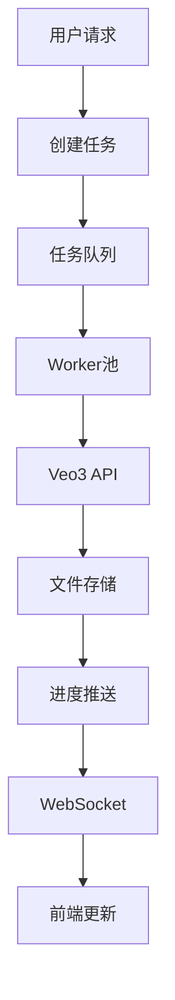
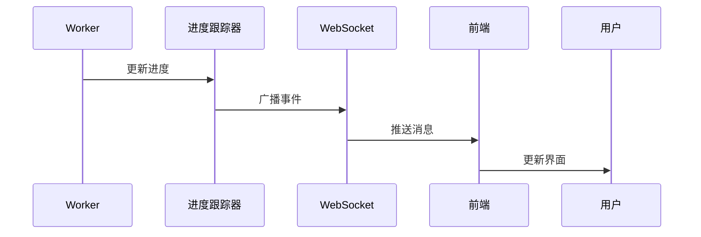
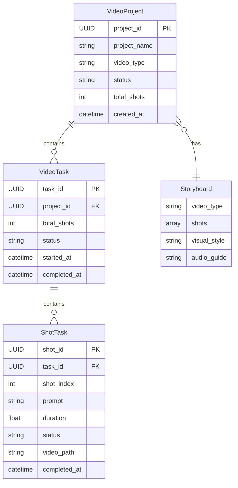
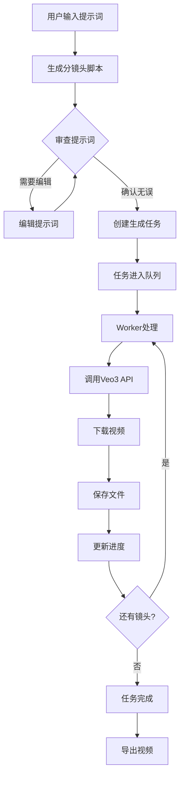
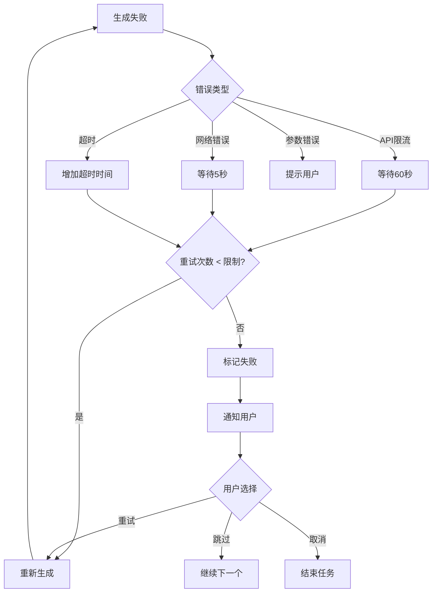

# 视频生成系统架构总结

> **基于 Google Veo3 的视频生成系统 - 完整架构设计总结**
> 
> 创建时间：2025-12-31
> 版本：v1.0

---

## 📋 快速导航

| 文档 | 内容 | 链接 |
|------|------|------|
| 系统架构 | 整体架构、模块设计、技术栈 | [`VIDEO_GENERATION_ARCHITECTURE.md`](./VIDEO_GENERATION_ARCHITECTURE.md) |
| 工作流程 | 分镜头到视频的完整流程 | [`VIDEO_GENERATION_WORKFLOW.md`](./VIDEO_GENERATION_WORKFLOW.md) |
| API设计 | RESTful API 和 WebSocket 接口 | [`VIDEO_GENERATION_API_DESIGN.md`](./VIDEO_GENERATION_API_DESIGN.md) |
| 实施计划 | 6周实施计划和任务分解 | [`VIDEO_GENERATION_IMPLEMENTATION_PLAN.md`](./VIDEO_GENERATION_IMPLEMENTATION_PLAN.md) |
| 系统指南 | 用户使用指南 | [`VIDEO_GENERATION_SYSTEM_GUIDE.md`](./VIDEO_GENERATION_SYSTEM_GUIDE.md) |
| 快速开始 | 快速上手指南 | [`VIDEO_QUICK_START.md`](./VIDEO_QUICK_START.md) |

---

## 核心设计理念

### 1. 工作流优先

```
提示词就绪 → 分镜头脚本 → 逐步生成视频 → 导出成品
```

**关键点**：
- 分镜头脚本是核心，确保每个镜头的提示词准确
- 逐步生成，每个镜头独立处理，可监控、可干预
- Veo3自带音频，无需额外音频处理

### 2. 异步任务架构



**优势**：
- 长时任务不阻塞用户界面
- 支持并发生成多个镜头
- 灵活的重试和错误处理

### 3. 实时进度反馈



**用户体验**：
- 实时看到生成进度
- 了解预计完成时间
- 可以暂停/恢复/取消

---

## 架构层次

### 分层架构

```
┌─────────────────────────────────────────┐
│          前端展示层                       │
│  - 任务监控面板                          │
│  - 进度实时显示                          │
│  - 视频预览播放                          │
└─────────────────────────────────────────┘
                  ↓
┌─────────────────────────────────────────┐
│          API网关层                       │
│  - RESTful API                          │
│  - WebSocket服务                         │
│  - 认证授权                              │
└─────────────────────────────────────────┘
                  ↓
┌─────────────────────────────────────────┐
│          业务逻辑层                       │
│  ┌──────────┬──────────┬──────────┐     │
│  │ 任务调度器 │ Veo3适配器 │ 进度跟踪器 │     │
│  └──────────┴──────────┴──────────┘     │
│  ┌──────────┬──────────┬──────────┐     │
│  │ 项目管理器 │ 文件管理器 │ 存储管理器 │     │
│  └──────────┴──────────┴──────────┘     │
└─────────────────────────────────────────┘
                  ↓
┌─────────────────────────────────────────┐
│          数据访问层                       │
│  - PostgreSQL (任务数据)                 │
│  - Redis (消息队列)                      │
└─────────────────────────────────────────┘
                  ↓
┌─────────────────────────────────────────┐
│          外部服务层                       │
│  - Google Veo3 API                       │
│  - 对象存储 (S3/OSS)                     │
└─────────────────────────────────────────┘
```

---

## 核心模块

### 1. 任务调度器 (VideoTaskScheduler)

**职责**：
- 管理任务队列
- 分配镜头给Worker
- 控制并发数量
- 处理任务状态变化

**关键方法**：
```python
async def submit_task(task: VideoTask) -> str
async def assign_shot(worker: Worker) -> Optional[Shot]
async def on_shot_completed(task_id: str, shot_index: int, result: VideoGenerationResult)
```

### 2. Worker (VideoWorker)

**职责**：
- 执行视频生成任务
- 调用Veo3 API
- 处理生成结果
- 实现重试逻辑

**工作循环**：
```python
while True:
    shot = await scheduler.assign_shot(self)
    if shot:
        try:
            result = await veo3.generate_video(shot)
            await scheduler.on_shot_completed(shot, result)
        except Exception as e:
            await handle_failure(shot, e)
```

### 3. Veo3适配器 (Veo3Adapter)

**职责**：
- 封装Veo3 API调用
- 构建请求体
- 处理响应
- 管理限流

**核心流程**：
```python
# 1. 构建请求
request_body = build_veo3_request(shot, config)

# 2. 提交生成
generation_id = await submit_generation(request_body)

# 3. 轮询状态
while not done:
    status = await get_status(generation_id)
    await asyncio.sleep(5)

# 4. 下载视频
video_path = await download_video(status.video_uri)
```

### 4. 进度跟踪器 (ProgressTracker)

**职责**：
- 记录任务进度
- 计算完成率
- 估算剩余时间
- 广播进度事件

**进度计算**：
```python
overall_progress = (completed_shots / total_shots) + 
                   (current_shot_progress / total_shots)
```

### 5. 文件存储管理器 (VideoStorageManager)

**职责**：
- 保存生成的视频
- 生成缩略图
- 管理文件URL
- 清理旧文件

**存储结构**：
```
视频项目/
└── {project_id}/
    ├── config.json
    ├── storyboard.json
    ├── shots/
    │   ├── shot_000.mp4
    │   ├── shot_001.mp4
    │   └── ...
    ├── previews/
    │   ├── shot_000_thumb.jpg
    │   └── ...
    └── exports/
        └── final.mp4
```

---

## 数据模型

### 核心实体关系



---

## 关键流程

### 完整生成流程



### 错误处理流程



---

## API设计要点

### RESTful API

| 类别 | 端点 | 功能 |
|------|------|------|
| 项目 | `POST /api/video/projects` | 创建项目 |
| 项目 | `GET /api/video/projects/{id}` | 获取项目详情 |
| 项目 | `DELETE /api/video/projects/{id}` | 删除项目 |
| 任务 | `POST /api/video/tasks` | 创建任务 |
| 任务 | `POST /api/video/tasks/{id}/start` | 启动任务 |
| 任务 | `GET /api/video/tasks/{id}/status` | 获取状态 |
| 任务 | `POST /api/video/tasks/{id}/retry` | 重试失败 |
| 视频 | `POST /api/video/shots/generate` | 生成镜头 |

### WebSocket消息

| 类型 | 方向 | 说明 |
|------|------|------|
| `progress` | 服务→客户端 | 进度更新 |
| `shot_started` | 服务→客户端 | 镜头开始 |
| `shot_completed` | 服务→客户端 | 镜头完成 |
| `shot_failed` | 服务→客户端 | 镜头失败 |
| `task_completed` | 服务→客户端 | 任务完成 |
| `pause` | 客户端→服务 | 暂停任务 |
| `resume` | 客户端→服务 | 恢复任务 |

---

## 技术栈

### 后端

| 技术 | 用途 |
|------|------|
| Python 3.10+ | 主要语言 |
| Flask | Web框架 |
| Celery | 任务队列 |
| Redis | 消息代理 |
| PostgreSQL | 数据库 |
| httpx | HTTP客户端 |

### 前端

| 技术 | 用途 |
|------|------|
| JavaScript ES2022 | 主要语言 |
| WebSocket | 实时通信 |
| Video.js | 视频播放 |

### 基础设施

| 技术 | 用途 |
|------|------|
| Docker | 容器化 |
| Nginx | 反向代理 |
| S3/OSS | 对象存储 |

---

## 实施路线图

### Phase 1: 基础架构 (Week 1)
- 数据库设计
- 核心数据模型
- Veo3适配器

### Phase 2: 任务调度 (Week 2)
- 任务调度器
- Worker实现
- Celery集成

### Phase 3: 进度与存储 (Week 3)
- 进度跟踪系统
- WebSocket服务
- 文件存储管理

### Phase 4: API与前端 (Week 4)
- API接口实现
- 前端界面更新
- 集成测试

### Phase 5: 优化与部署 (Week 5-6)
- 性能优化
- 错误处理完善
- 文档完善
- 生产部署

---

## 关键设计决策

### 1. 为什么使用Celery？

**优势**：
- 成熟的任务队列系统
- 支持分布式部署
- 内置重试机制
- 丰富的监控工具

### 2. 为什么使用WebSocket？

**优势**：
- 实时双向通信
- 服务器主动推送
- 减少轮询开销
- 更好的用户体验

### 3. 为什么分镜头优先？

**优势**：
- 用户可以审查每个镜头
- 确保提示词准确
- 减少生成失败
- 提高视频质量

### 4. 为什么Veo3自带音频？

**优势**：
- 无需额外音频处理
- 音视频同步更好
- 简化架构
- 降低成本

---

## 性能考虑

### 并发控制

```python
# 限制同时生成的镜头数
MAX_CONCURRENT = 3

# Worker池大小
MAX_WORKERS = 5

# API限流
RATE_LIMIT = 10 requests/minute
```

### 存储优化

```python
# 自动清理策略
CLEANUP_POLICY = {
    "keep_days": 30,
    "max_size_gb": 100
}
```

### 缓存策略

```python
# Redis缓存
CACHE_TTL = {
    "task_status": 60,  # 60秒
    "project_info": 300  # 5分钟
}
```

---

## 安全考虑

### API密钥管理

```python
# 环境变量
VEO3_API_KEY = os.getenv("VEO3_API_KEY")

# 密钥轮换
KEY_ROTATION_DAYS = 90
```

### 文件访问控制

```python
# 用户隔离
USER_ISOLATION = True

# 签名URL
SIGNED_URL_TTL = 3600  # 1小时
```

### 任务权限

```python
# 只能访问自己的项目
PROJECT_OWNERSHIP_CHECK = True

# 任务取消权限
TASK_CANCEL_PERMISSION = "owner"
```

---

## 监控指标

### 关键指标

| 指标 | 说明 | 告警阈值 |
|------|------|----------|
| 任务成功率 | 成功任务/总任务 | < 95% |
| 平均生成时间 | 单个镜头平均耗时 | > 120秒 |
| API错误率 | API调用失败率 | > 5% |
| 存储使用量 | 已用存储空间 | > 80% |
| 队列深度 | 待处理任务数 | > 100 |

### 日志记录

```python
# 日志级别
LOG_LEVEL = "INFO"

# 关键事件
CRITICAL_EVENTS = [
    "task_failed",
    "api_error",
    "storage_full"
]
```

---

## 扩展性设计

### 水平扩展

```python
# 增加Worker
SCALE_WORKERS = "kubectl scale deployment video-worker --replicas=10"

# 增加API服务器
SCALE_API = "kubectl scale deployment video-api --replicas=3"
```

### 功能扩展

```python
# 支持更多视频生成服务
SUPPORTED_SERVICES = {
    "veo3": Veo3Adapter,
    "runway": RunwayAdapter,  # 未来扩展
    "pika": PikaAdapter       # 未来扩展
}

# 支持更多存储后端
SUPPORTED_STORAGE = {
    "local": LocalStorage,
    "s3": S3Storage,
    "oss": OSSStorage
}
```

---

## 文档清单

### 开发文档

- [x] [`VIDEO_GENERATION_ARCHITECTURE.md`](./VIDEO_GENERATION_ARCHITECTURE.md) - 系统架构设计
- [x] [`VIDEO_GENERATION_WORKFLOW.md`](./VIDEO_GENERATION_WORKFLOW.md) - 工作流程设计
- [x] [`VIDEO_GENERATION_API_DESIGN.md`](./VIDEO_GENERATION_API_DESIGN.md) - API接口设计
- [x] [`VIDEO_GENERATION_IMPLEMENTATION_PLAN.md`](./VIDEO_GENERATION_IMPLEMENTATION_PLAN.md) - 实施计划

### 用户文档

- [x] [`VIDEO_GENERATION_SYSTEM_GUIDE.md`](./VIDEO_GENERATION_SYSTEM_GUIDE.md) - 系统使用指南
- [x] [`VIDEO_QUICK_START.md`](./VIDEO_QUICK_START.md) - 快速开始指南

### 总结文档

- [x] `VIDEO_GENERATION_ARCHITECTURE_SUMMARY.md` - 本文档

---

## 下一步行动

### 立即开始

1. **审查架构设计** - 确认设计符合需求
2. **准备开发环境** - 安装依赖和工具
3. **创建数据库** - 执行建表脚本
4. **配置Veo3 API** - 获取API密钥

### 第一周目标

- [ ] 完成数据库表创建
- [ ] 实现核心数据模型
- [ ] 实现Veo3适配器
- [ ] 编写单元测试

### 第一个月目标

- [ ] 完成基础架构
- [ ] 实现任务调度系统
- [ ] 实现进度跟踪
- [ ] 实现文件存储

---

**文档版本**：v1.0  
**最后更新**：2025-12-31  
**维护者**：Kilo Code  
**审核状态**：待审核

**联系方式**：如有问题或建议，请创建 Issue 或 Pull Request