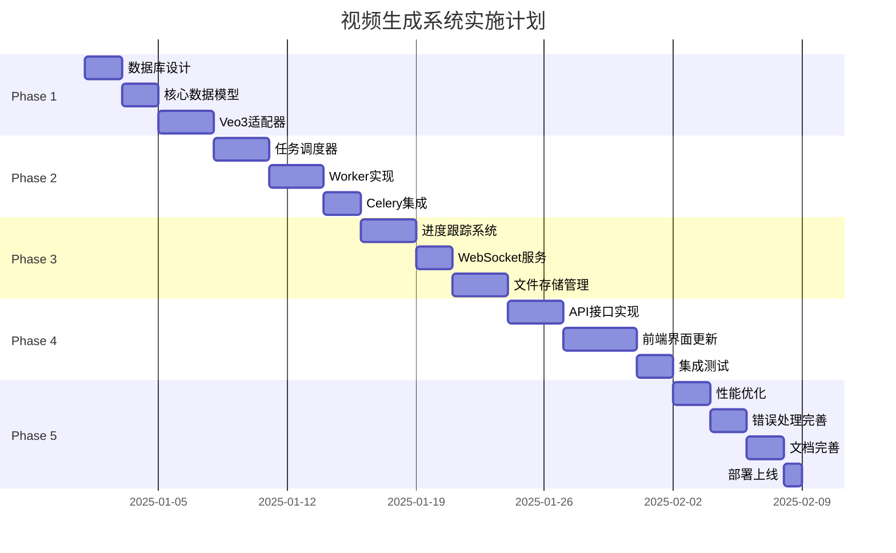

# 视频生成系统技术实施计划

> **从架构设计到落地执行的完整路线图**
> 
> 创建时间：2025-12-31
> 版本：v1.0
> 预计工期：6周

---

## 📋 目录

1. [项目概述](#项目概述)
2. [技术栈选型](#技术栈选型)
3. [实施阶段划分](#实施阶段划分)
4. [详细任务清单](#详细任务清单)
5. [里程碑与交付物](#里程碑与交付物)
6. [风险管理](#风险管理)
7. [测试策略](#测试策略)
8. [部署方案](#部署方案)

---

## 项目概述

### 目标

构建一个**基于Google Veo3的企业级视频生成系统**，核心工作流：

```
提示词就绪 → 分镜头脚本 → 逐步生成视频 → 导出成品
```

### 核心特性

✅ **智能分镜头** - 自动生成专业分镜头脚本  
✅ **Veo3集成** - 无缝集成Google Veo3 API（含音频）  
✅ **异步任务** - 高效处理长时视频生成  
✅ **实时进度** - WebSocket推送生成进度  
✅ **智能重试** - 自动处理API失败  
✅ **完整管理** - 项目/任务/文件全生命周期管理  

### 项目范围

| 功能模块 | 优先级 | 工作量 |
|---------|-------|--------|
| Veo3 API集成 | P0 | 1周 |
| 任务调度系统 | P0 | 1.5周 |
| 进度跟踪 | P0 | 1周 |
| WebSocket服务 | P0 | 0.5周 |
| 文件存储管理 | P0 | 1周 |
| 前端界面更新 | P1 | 1周 |
| 测试与优化 | P1 | 0.5周 |

---

## 技术栈选型

### 后端技术

| 技术 | 版本 | 用途 |
|------|------|------|
| Python | 3.10+ | 主要开发语言 |
| Flask | 2.3+ | Web框架 |
| Celery | 5.3+ | 异步任务队列 |
| Redis | 7.0+ | 消息代理 |
| PostgreSQL | 14+ | 数据库 |
| SQLAlchemy | 2.0+ | ORM |
| httpx | 0.24+ | 异步HTTP客户端 |
| ffmpeg-python | 0.2+ | 视频处理 |

### 前端技术

| 技术 | 版本 | 用途 |
|------|------|------|
| JavaScript | ES2022 | 主要语言 |
| WebSocket API | - | 实时通信 |
| Video.js | 8.0+ | 视频播放器 |

### 基础设施

| 技术 | 用途 |
|------|------|
| Docker | 容器化部署 |
| Nginx | 反向代理 |
| S3/OSS | 对象存储（生产环境） |

---

## 实施阶段划分

### 阶段总览



---

## 详细任务清单

### Phase 1: 基础架构（Week 1）

#### 1.1 数据库设计 (2天)

**任务**：设计和创建数据库表结构

**交付物**：
- [ ] 数据库ER图
- [ ] SQL建表脚本
- [ ] SQLAlchemy模型定义

**详细步骤**：

```sql
-- 1. 视频项目表
CREATE TABLE video_projects (
    project_id UUID PRIMARY KEY DEFAULT gen_random_uuid(),
    user_id VARCHAR(36) NOT NULL,
    project_name VARCHAR(255) NOT NULL,
    novel_title VARCHAR(255),
    video_type VARCHAR(50) NOT NULL,
    status VARCHAR(50) DEFAULT 'created',
    total_shots INT DEFAULT 0,
    completed_shots INT DEFAULT 0,
    failed_shots INT DEFAULT 0,
    storyboard_json JSONB,
    config_json JSONB,
    created_at TIMESTAMP DEFAULT NOW(),
    updated_at TIMESTAMP DEFAULT NOW(),
    INDEX idx_user_id (user_id),
    INDEX idx_status (status)
);

-- 2. 视频任务表
CREATE TABLE video_tasks (
    task_id UUID PRIMARY KEY DEFAULT gen_random_uuid(),
    project_id UUID NOT NULL REFERENCES video_projects(project_id),
    total_shots INT NOT NULL,
    completed_shots INT DEFAULT 0,
    failed_shots INT DEFAULT 0,
    status VARCHAR(50) DEFAULT 'pending',
    config_json JSONB,
    created_at TIMESTAMP DEFAULT NOW(),
    started_at TIMESTAMP,
    completed_at TIMESTAMP,
    error_message TEXT,
    INDEX idx_project (project_id),
    INDEX idx_status (status)
);

-- 3. 镜头任务表
CREATE TABLE shot_tasks (
    shot_id UUID PRIMARY KEY DEFAULT gen_random_uuid(),
    task_id UUID NOT NULL REFERENCES video_tasks(task_id),
    shot_index INT NOT NULL,
    prompt TEXT NOT NULL,
    duration FLOAT NOT NULL,
    status VARCHAR(50) DEFAULT 'pending',
    video_path VARCHAR(512),
    thumbnail_path VARCHAR(512),
    error_message TEXT,
    retry_count INT DEFAULT 0,
    created_at TIMESTAMP DEFAULT NOW(),
    started_at TIMESTAMP,
    completed_at TIMESTAMP,
    INDEX idx_task (task_id),
    INDEX idx_status (status),
    UNIQUE(task_id, shot_index)
);
```

**文件**：
- `src/models/video_project_model.py`
- `migrations/create_video_tables.sql`

#### 1.2 核心数据模型 (2天)

**任务**：实现Python数据模型

**交付物**：
- [ ] `VideoProject` 类
- [ ] `VideoTask` 类
- [ ] `ShotTask` 类
- [ ] 模型序列化/反序列化

**代码框架**：

```python
# src/models/video_generation.py
from dataclasses import dataclass
from datetime import datetime
from typing import Optional, List
from enum import Enum

class TaskStatus(str, Enum):
    PENDING = "pending"
    QUEUED = "queued"
    RUNNING = "running"
    PAUSED = "paused"
    COMPLETED = "completed"
    FAILED = "failed"
    CANCELLED = "cancelled"

class ShotStatus(str, Enum):
    PENDING = "pending"
    ASSIGNED = "assigned"
    PROCESSING = "processing"
    COMPLETED = "completed"
    FAILED = "failed"

@dataclass
class Shot:
    """单个镜头"""
    shot_index: int
    shot_number: int
    shot_type: str
    camera_movement: str
    duration_seconds: float
    description: str
    generation_prompt: str
    audio_prompt: str
    status: ShotStatus = ShotStatus.PENDING
    video_path: Optional[str] = None
    thumbnail_path: Optional[str] = None
    error_message: Optional[str] = None
    created_at: datetime = None
    started_at: Optional[datetime] = None
    completed_at: Optional[datetime] = None

@dataclass
class VideoTask:
    """视频生成任务"""
    task_id: str
    project_id: str
    shots: List[Shot]
    status: TaskStatus = TaskStatus.PENDING
    config: dict = None
    created_at: datetime = None
    started_at: Optional[datetime] = None
    completed_at: Optional[datetime] = None
```

**文件**：
- `src/models/video_generation.py`
- `src/models/shot.py`
- `src/models/task.py`

#### 1.3 Veo3适配器 (3天)

**任务**：实现Google Veo3 API适配器

**交付物**：
- [ ] `Veo3Adapter` 类
- [ ] API请求构建
- [ ] 响应解析
- [ ] 错误处理
- [ ] 限流控制
- [ ] 单元测试

**代码框架**：

```python
# src/services/veo3_adapter.py
import httpx
import asyncio
from typing import Optional
from src.models.video_generation import Shot
from src.config.video_config import VIDEO_CONFIG

class Veo3Adapter:
    """Google Veo3 API适配器"""
    
    def __init__(self):
        self.api_key = VIDEO_CONFIG["veo3"]["api_key"]
        self.base_url = VIDEO_CONFIG["veo3"]["base_url"]
        self.model = VIDEO_CONFIG["veo3"]["model"]
        self.timeout = VIDEO_CONFIG["veo3"]["timeout"]
        
        # 限流器
        self.rate_limiter = RateLimiter(
            max_requests=VIDEO_CONFIG["rate_limit"]["requests_per_minute"],
            time_window=60
        )
    
    async def generate_video(
        self,
        shot: Shot,
        config: dict
    ) -> VideoGenerationResult:
        """
        生成单个镜头视频
        
        Args:
            shot: 镜头对象
            config: 生成配置
        
        Returns:
            VideoGenerationResult: 生成结果
        """
        # 1. 构建请求
        request_body = self._build_request(shot, config)
        
        # 2. 限流检查
        await self.rate_limiter.acquire()
        
        # 3. 调用API
        async with httpx.AsyncClient(timeout=self.timeout) as client:
            # 提交生成请求
            response = await client.post(
                f"{self.base_url}/{self.model}:predictLongRunning",
                params={"key": self.api_key},
                json=request_body
            )
            
            if response.status_code != 200:
                raise Veo3APIError(f"API调用失败: {response.text}")
            
            result = response.json()
            generation_id = result["name"]
            
            # 4. 轮询状态
            while True:
                status = await self._get_status(generation_id, client)
                
                if status.done:
                    return VideoGenerationResult(
                        shot_index=shot.shot_index,
                        video_path=await self._download_video(status.video_uri),
                        thumbnail_path=await self._generate_thumbnail(status.video_uri),
                        success=True
                    )
                
                await asyncio.sleep(5)
    
    def _build_request(self, shot: Shot, config: dict) -> dict:
        """构建Veo3请求体"""
        return {
            "prompt": {
                "text": shot.generation_prompt,
                "audio_prompt": shot.audio_prompt
            },
            "generation_config": {
                "duration_seconds": shot.duration_seconds,
                "aspect_ratio": config.get("aspect_ratio", "16:9"),
                "video_quality": config.get("video_quality", "HD"),
                "number_of_videos": 1
            }
        }
```

**文件**：
- `src/services/veo3_adapter.py`
- `src/services/rate_limiter.py`
- `tests/test_veo3_adapter.py`

---

### Phase 2: 任务调度系统（Week 2）

#### 2.1 任务调度器 (3天)

**任务**：实现异步任务调度器

**交付物**：
- [ ] `VideoTaskScheduler` 类
- [ ] 任务队列管理
- [ ] Worker池管理
- [ ] 并发控制
- [ ] 任务状态管理

**代码框架**：

```python
# src/schedulers/video_task_scheduler.py
import asyncio
from typing import List, Optional
from src.models.video_generation import VideoTask, Shot, TaskStatus, ShotStatus
from src.workers.video_worker import VideoWorker

class VideoTaskScheduler:
    """视频任务调度器"""
    
    def __init__(self, config: dict):
        self.config = config
        self.task_queue = asyncio.Queue()
        self.active_tasks: dict = {}
        self.workers: List[VideoWorker] = []
        
        # 创建Worker池
        for i in range(config.get("max_workers", 3)):
            worker = VideoWorker(worker_id=i, scheduler=self)
            self.workers.append(worker)
    
    async def submit_task(self, task: VideoTask) -> str:
        """提交任务到队列"""
        await self.task_queue.put(task)
        self.active_tasks[task.task_id] = task
        return task.task_id
    
    async def assign_shot(self, worker: VideoWorker) -> Optional[Shot]:
        """分配镜头给Worker"""
        # 检查并发限制
        active_count = sum(
            1 for t in self.active_tasks.values()
            if t.status == TaskStatus.RUNNING
        )
        
        if active_count >= self.config.get("max_concurrent", 3):
            return None
        
        # 从队列获取任务
        task = await self.task_queue.get()
        
        # 找到待处理的镜头
        for shot in task.shots:
            if shot.status == ShotStatus.PENDING:
                shot.status = ShotStatus.ASSIGNED
                task.status = TaskStatus.RUNNING
                return shot
        
        return None
    
    async def on_shot_completed(
        self,
        task_id: str,
        shot_index: int,
        result: VideoGenerationResult
    ):
        """镜头完成回调"""
        task = self.active_tasks[task_id]
        shot = task.shots[shot_index]
        
        shot.status = ShotStatus.COMPLETED
        shot.video_path = result.video_path
        shot.thumbnail_path = result.thumbnail_path
        shot.completed_at = datetime.now()
        
        task.completed_shots += 1
        
        # 检查是否全部完成
        if task.completed_shots == len(task.shots):
            task.status = TaskStatus.COMPLETED
            task.completed_at = datetime.now()
```

**文件**：
- `src/schedulers/video_task_scheduler.py`
- `tests/test_scheduler.py`

#### 2.2 Worker实现 (3天)

**任务**：实现视频生成Worker

**交付物**：
- [ ] `VideoWorker` 类
- [ ] 镜头生成逻辑
- [ ] 进度报告
- [ ] 错误处理
- [ ] 重试机制

**代码框架**：

```python
# src/workers/video_worker.py
import asyncio
from src.models.video_generation import Shot, ShotStatus, VideoGenerationResult
from src.services.veo3_adapter import Veo3Adapter
from src.schedulers.video_task_scheduler import VideoTaskScheduler

class VideoWorker:
    """视频生成Worker"""
    
    def __init__(self, worker_id: int, scheduler: VideoTaskScheduler):
        self.worker_id = worker_id
        self.scheduler = scheduler
        self.veo3 = Veo3Adapter()
        self.current_shot: Optional[Shot] = None
    
    async def run(self):
        """Worker主循环"""
        while True:
            # 获取任务
            shot = await self.scheduler.assign_shot(self)
            
            if shot is None:
                await asyncio.sleep(1)
                continue
            
            self.current_shot = shot
            
            try:
                # 生成视频
                result = await self._generate_shot(shot)
                
                # 成功回调
                await self.scheduler.on_shot_completed(
                    shot.task_id,
                    shot.shot_index,
                    result
                )
                
            except Exception as e:
                # 失败处理
                await self._handle_failure(shot, e)
            
            finally:
                self.current_shot = None
    
    async def _generate_shot(self, shot: Shot) -> VideoGenerationResult:
        """生成单个镜头"""
        shot.status = ShotStatus.PROCESSING
        shot.started_at = datetime.now()
        
        # 调用Veo3
        result = await self.veo3.generate_video(
            shot=shot,
            config=shot.config
        )
        
        return result
    
    async def _handle_failure(self, shot: Shot, error: Exception):
        """处理失败"""
        shot.status = ShotStatus.FAILED
        shot.error_message = str(error)
        shot.retry_count += 1
        
        # 检查是否重试
        if shot.retry_count < shot.config.get("retry_limit", 3):
            # 延迟后重试
            await asyncio.sleep(shot.config.get("retry_delay", 60))
            shot.status = ShotStatus.PENDING
        else:
            # 重试次数用尽
            await self.scheduler.on_shot_failed(shot.task_id, shot.shot_index)
```

**文件**：
- `src/workers/video_worker.py`
- `tests/test_worker.py`

#### 2.3 Celery集成 (2天)

**任务**：集成Celery作为任务队列

**交付物**：
- [ ] Celery配置
- [ ] Celery任务定义
- [ ] Worker启动脚本
- [ ] 监控配置

**代码框架**：

```python
# src/celery_app.py
from celery import Celery

celery_app = Celery('video_generation')

celery_app.config_from_object({
    'broker_url': 'redis://localhost:6379/0',
    'result_backend': 'redis://localhost:6379/0',
    'task_routes': {
        'src.tasks.generate_shot': {'queue': 'video_generation'},
    },
    'worker_prefetch_multiplier': 1,
    'task_acks_late': True,
})

# src/tasks/video_tasks.py
from src.celery_app import celery_app
from src.services.veo3_adapter import Veo3Adapter

@celery_app.task(bind=True, max_retries=3)
def generate_shot_task(self, shot_data: dict):
    """Celery任务：生成单个镜头"""
    try:
        adapter = Veo3Adapter()
        result = adapter.generate_video_sync(shot_data)
        return result
    except Exception as e:
        # 重试
        raise self.retry(exc=e, countdown=60)
```

**文件**：
- `src/celery_app.py`
- `src/tasks/video_tasks.py`
- `scripts/start_celery_worker.sh`

---

### Phase 3: 进度与存储（Week 3）

#### 3.1 进度跟踪系统 (3天)

**任务**：实现实时进度跟踪

**交付物**：
- [ ] `ProgressTracker` 类
- [ ] 进度计算
- [ ] 时间估算
- [ ] 事件记录

**代码框架**：

```python
# src/services/progress_tracker.py
from datetime import datetime, timedelta
from typing import List

@dataclass
class TaskProgress:
    task_id: str
    total_shots: int
    completed_shots: int = 0
    failed_shots: int = 0
    current_shot_index: int = 0
    current_shot_progress: float = 0.0
    overall_progress: float = 0.0
    estimated_remaining_seconds: int = 0
    status_message: str = ""
    updated_at: datetime = None
    
    def calculate_overall_progress(self) -> float:
        """计算整体进度"""
        if self.total_shots == 0:
            return 0.0
        
        completed_ratio = self.completed_shots / self.total_shots
        
        if self.completed_shots < self.total_shots:
            current_ratio = self.current_shot_progress / self.total_shots
        else:
            current_ratio = 0.0
        
        return completed_ratio + current_ratio
    
    def estimate_completion(self, started_at: datetime) -> datetime:
        """估算完成时间"""
        if self.completed_shots == 0:
            return None
        
        elapsed = (datetime.now() - started_at).total_seconds()
        avg_time = elapsed / self.completed_shots
        remaining = self.total_shots - self.completed_shots
        
        self.estimated_remaining_seconds = int(avg_time * remaining)
        return datetime.now() + timedelta(seconds=self.estimated_remaining_seconds)

class ProgressTracker:
    """进度跟踪器"""
    
    def __init__(self):
        self.progress_cache: dict = {}
    
    def update_progress(
        self,
        task_id: str,
        shot_index: int,
        progress: float,
        message: str
    ):
        """更新进度"""
        if task_id not in self.progress_cache:
            self.progress_cache[task_id] = TaskProgress(
                task_id=task_id,
                total_shots=0,
                updated_at=datetime.now()
            )
        
        tracker = self.progress_cache[task_id]
        tracker.current_shot_index = shot_index
        tracker.current_shot_progress = progress
        tracker.status_message = message
        tracker.overall_progress = tracker.calculate_overall_progress()
        tracker.updated_at = datetime.now()
```

**文件**：
- `src/services/progress_tracker.py`
- `tests/test_progress_tracker.py`

#### 3.2 WebSocket服务 (2天)

**任务**：实现WebSocket实时推送

**交付物**：
- [ ] WebSocket路由
- [ ] 消息广播
- [ ] 连接管理
- [ ] 前端集成

**代码框架**：

```python
# src/websocket/video_progress_ws.py
from flask_socketio import SocketIO, emit, join_room

socketio = SocketIO()

class VideoProgressWebSocket:
    """视频进度WebSocket服务"""
    
    def __init__(self, progress_tracker: ProgressTracker):
        self.progress_tracker = progress_tracker
        self.connections: dict = {}
    
    def broadcast_progress(self, task_id: str):
        """广播进度更新"""
        progress = self.progress_tracker.get_progress(task_id)
        
        socketio.emit(
            'progress',
            {
                'type': 'progress',
                'data': {
                    'task_id': task_id,
                    'total_shots': progress.total_shots,
                    'completed_shots': progress.completed_shots,
                    'current_shot_index': progress.current_shot_index,
                    'overall_progress': progress.overall_progress,
                    'estimated_remaining': progress.estimated_remaining_seconds,
                    'status_message': progress.status_message,
                    'timestamp': datetime.now().isoformat()
                }
            },
            room=f'task_{task_id}'
        )
    
    def broadcast_shot_completed(
        self,
        task_id: str,
        shot_index: int,
        video_path: str,
        thumbnail_path: str
    ):
        """广播镜头完成"""
        socketio.emit(
            'shot_completed',
            {
                'type': 'shot_completed',
                'data': {
                    'task_id': task_id,
                    'shot_index': shot_index,
                    'video_url': f'/static/videos/{video_path}',
                    'thumbnail_url': f'/static/videos/{thumbnail_path}',
                    'timestamp': datetime.now().isoformat()
                }
            },
            room=f'task_{task_id}'
        )

# 路由
@socketio.on('connect')
def handle_connect(data):
    task_id = data.get('task_id')
    join_room(f'task_{task_id}')

@socketio.on('disconnect')
def handle_disconnect():
    pass
```

**文件**：
- `src/websocket/video_progress_ws.py`
- `src/websocket/__init__.py`

#### 3.3 文件存储管理 (3天)

**任务**：实现文件存储管理

**交付物**：
- [ ] `VideoStorageManager` 类
- [ ] 本地存储实现
- [ ] S3存储适配器
- [ ] 文件清理策略

**代码框架**：

```python
# src/services/video_storage_manager.py
from pathlib import Path
from typing import Optional
import shutil

class VideoStorageManager:
    """视频文件存储管理器"""
    
    def __init__(self, config: dict):
        self.config = config
        self.base_path = Path(config.get("base_path", "视频项目"))
        self.storage_type = config.get("type", "local")
        
        if self.storage_type == "s3":
            from src.services.s3_storage import S3StorageAdapter
            self.storage = S3StorageAdapter(config["s3_config"])
        else:
            from src.services.local_storage import LocalStorageAdapter
            self.storage = LocalStorageAdapter(self.base_path)
    
    def save_video(
        self,
        project_id: str,
        shot_index: int,
        video_data: bytes
    ) -> str:
        """保存视频文件"""
        filename = f"shot_{shot_index:03d}.mp4"
        path = f"{project_id}/shots/{filename}"
        
        self.storage.save(path, video_data)
        
        # 生成缩略图
        thumbnail_path = self._generate_thumbnail(path, video_data)
        
        return path
    
    def get_video_url(self, path: str) -> str:
        """获取视频URL"""
        return self.storage.get_url(path)
    
    def _generate_thumbnail(self, video_path: str, video_data: bytes) -> str:
        """生成缩略图"""
        import cv2
        import tempfile
        
        # 保存临时文件
        with tempfile.NamedTemporaryFile(delete=False, suffix='.mp4') as f:
            f.write(video_data)
            temp_path = f.name
        
        # 提取第一帧
        cap = cv2.VideoCapture(temp_path)
        ret, frame = cap.read()
        cap.release()
        
        # 保存缩略图
        thumbnail_path = video_path.replace('.mp4', '_thumb.jpg')
        cv2.imwrite(thumbnail_path, frame)
        
        # 清理临时文件
        Path(temp_path).unlink()
        
        return thumbnail_path
    
    def delete_project(self, project_id: str):
        """删除项目所有文件"""
        self.storage.delete_directory(project_id)
```

**文件**：
- `src/services/video_storage_manager.py`
- `src/services/local_storage.py`
- `src/services/s3_storage.py`

---

### Phase 4: API与前端（Week 4）

#### 4.1 API接口实现 (3天)

**任务**：实现所有REST API

**交付物**：
- [ ] 项目管理API
- [ ] 任务管理API
- [ ] 视频生成API
- [ ] 错误处理中间件

**参考文档**：[`VIDEO_GENERATION_API_DESIGN.md`](./VIDEO_GENERATION_API_DESIGN.md)

**文件**：
- `src/api/video_projects_api.py`
- `src/api/video_tasks_api.py`
- `src/api/video_generation_api_extended.py`

#### 4.2 前端界面更新 (4天)

**任务**：更新前端界面

**交付物**：
- [ ] 任务监控面板
- [ ] 进度显示组件
- [ ] WebSocket客户端
- [ ] 视频预览播放器

**代码框架**：

```javascript
// web/static/js/video-generation-v2.js
class VideoGenerationV2 {
    constructor() {
        this.taskId = null;
        this.ws = null;
        this.progress = {
            total: 0,
            completed: 0,
            failed: 0,
            current: null
        };
    }
    
    async startGeneration() {
        // 启动生成任务
        const response = await fetch('/api/video/start-generation', {
            method: 'POST',
            body: JSON.stringify({project_id: this.projectId})
        });
        
        const result = await response.json();
        this.taskId = result.task_id;
        
        // 连接WebSocket
        this.connectWebSocket();
    }
    
    connectWebSocket() {
        const protocol = window.location.protocol === 'https:' ? 'wss:' : 'ws:';
        const wsUrl = `${protocol}//${window.location.host}/ws/video/${this.taskId}`;
        
        this.ws = new WebSocket(wsUrl);
        
        this.ws.onopen = () => {
            console.log('WebSocket连接成功');
        };
        
        this.ws.onmessage = (event) => {
            const message = JSON.parse(event.data);
            this.handleMessage(message);
        };
        
        this.ws.onerror = (error) => {
            console.error('WebSocket错误:', error);
        };
        
        this.ws.onclose = () => {
            console.log('WebSocket连接关闭');
        };
    }
    
    handleMessage(message) {
        switch(message.type) {
            case 'progress':
                this.updateProgress(message.data);
                break;
            case 'shot_completed':
                this.onShotCompleted(message.data);
                break;
            case 'task_completed':
                this.onTaskCompleted(message.data);
                break;
        }
    }
    
    updateProgress(data) {
        this.progress.total = data.total_shots;
        this.progress.completed = data.completed_shots;
        this.progress.failed = data.failed_shots;
        this.progress.current = data.current_shot_index;
        
        // 更新UI
        this.updateProgressBar(data.overall_progress);
        this.updateStats(data);
        this.updateEstimatedTime(data.estimated_remaining);
    }
    
    onShotCompleted(data) {
        // 更新镜头卡片
        const shotCard = document.querySelector(`[data-index="${data.shot_index}"]`);
        if (shotCard) {
            shotCard.classList.remove('processing');
            shotCard.classList.add('completed');
            
            // 显示缩略图
            const thumbnail = shotCard.querySelector('.shot-thumbnail');
            thumbnail.innerHTML = ``;
            
            // 添加预览按钮
            const actions = shotCard.querySelector('.shot-actions');
            actions.innerHTML = `
                <button onclick="videoGen.previewShot(${data.shot_index})">预览</button>
                <button onclick="videoGen.downloadShot(${data.shot_index})">下载</button>
            `;
        }
    }
    
    onTaskCompleted(data) {
        // 显示完成界面
        this.showCompletionScreen(data);
        
        // 播放完成动画
        this.playCompletionAnimation();
    }
}
```

**文件**：
- `web/templates/video-generation-v2.html`
- `web/static/js/video-generation-v2.js`
- `web/static/css/video-generation-v2.css`

#### 4.3 集成测试 (2天)

**任务**：编写和执行集成测试

**交付物**：
- [ ] 测试用例
- [ ] 测试报告
- [ ] Bug修复

---

### Phase 5: 优化与部署（Week 5-6）

#### 5.1 性能优化 (2天)

**任务**：优化系统性能

**优化项**：
- [ ] 数据库查询优化
- [ ] 缓存策略
- [ ] 并发控制调优
- [ ] 文件I/O优化

#### 5.2 错误处理完善 (2天)

**任务**：完善错误处理机制

**交付物**：
- [ ] 全局异常处理
- [ ] 错误日志记录
- [ ] 用户友好的错误提示
- [ ] 监控告警

#### 5.3 文档完善 (2天)

**任务**：完善系统文档

**交付物**：
- [ ] API文档
- [ ] 部署文档
- [ ] 用户手册
- [ ] 开发者指南

#### 5.4 部署上线 (1天)

**任务**：部署到生产环境

**步骤**：
1. 准备生产环境配置
2. 构建Docker镜像
3. 部署服务
4. 配置域名和SSL
5. 执行烟雾测试
6. 监控系统运行

---

## 里程碑与交付物

### Milestone 1: 基础架构完成 (Week 1结束)

**交付物**：
- ✅ 数据库表创建完成
- ✅ 核心数据模型实现
- ✅ Veo3适配器实现并测试通过
- ✅ 单元测试覆盖率 > 80%

**验收标准**：
- 能够成功调用Veo3 API生成单个视频
- 数据模型序列化/反序列化正常

### Milestone 2: 任务调度系统完成 (Week 2结束)

**交付物**：
- ✅ 任务调度器实现
- ✅ Worker实现并运行
- ✅ Celery集成完成
- ✅ 能够处理多个镜头的串行生成

**验收标准**：
- 能够提交并执行批量生成任务
- 任务状态正确更新

### Milestone 3: 进度跟踪完成 (Week 3结束)

**交付物**：
- ✅ 进度跟踪系统实现
- ✅ WebSocket服务实现
- ✅ 文件存储管理实现
- ✅ 前端能够实时接收进度更新

**验收标准**：
- 用户能够实时看到生成进度
- 生成的视频正确保存到存储

### Milestone 4: 系统集成完成 (Week 4结束)

**交付物**：
- ✅ 所有API实现
- ✅ 前端界面更新
- ✅ 端到端流程测试通过

**验收标准**：
- 用户能够完成完整的视频生成流程
- 系统稳定运行

### Milestone 5: 生产部署 (Week 5-6结束)

**交付物**：
- ✅ 性能优化完成
- ✅ 错误处理完善
- ✅ 文档齐全
- ✅ 生产环境部署

**验收标准**：
- 系统在生产环境稳定运行
- 响应时间符合要求

---

## 风险管理

### 技术风险

| 风险 | 影响 | 概率 | 应对措施 |
|------|------|------|----------|
| Veo3 API限流 | 高 | 中 | 实现智能限流和队列管理 |
| API不稳定 | 高 | 中 | 实现重试机制和降级策略 |
| 生成时间过长 | 中 | 高 | 实现并发生成和进度反馈 |
| 存储空间不足 | 中 | 中 | 实现自动清理和监控 |

### 进度风险

| 风险 | 影响 | 概率 | 应对措施 |
|------|------|------|----------|
| 需求变更 | 高 | 中 | 锁定核心需求，迭代开发 |
| 技术难点 | 中 | 低 | 提前技术预研，寻求支持 |
| 资源不足 | 中 | 低 | 合理分配资源，优先级管理 |

---

## 测试策略

### 测试金字塔

```
        /\
       /  \        E2E测试 (10%)
      /____\       - 完整工作流测试
     /      \      
    /        \     集成测试 (30%)
   /          \    - API测试
  /            \   - Worker测试
 /______________\  - WebSocket测试
                  单元测试 (60%)
                  - 模型测试
                  - 适配器测试
                  - 工具类测试
```

### 测试覆盖

| 模块 | 单元测试 | 集成测试 | E2E测试 |
|------|---------|---------|--------|
| 数据模型 | ✅ | ✅ | - |
| Veo3适配器 | ✅ | ✅ | - |
| 任务调度器 | ✅ | ✅ | ✅ |
| Worker | ✅ | ✅ | ✅ |
| 进度跟踪 | ✅ | ✅ | ✅ |
| 文件存储 | ✅ | ✅ | - |
| API | - | ✅ | ✅ |
| WebSocket | - | ✅ | ✅ |
| 前端 | ✅ | ✅ | ✅ |

---

## 部署方案

### 开发环境

```bash
# 启动所有服务
docker-compose up -d

# 查看日志
docker-compose logs -f

# 停止服务
docker-compose down
```

### 生产环境

```bash
# 1. 构建镜像
docker build -t video-generation:latest .

# 2. 推送到镜像仓库
docker push registry.example.com/video-generation:latest

# 3. 部署
kubectl apply -f k8s-deployment.yaml

# 4. 验证
kubectl get pods
kubectl logs -f deployment/video-generation
```

### 监控指标

- 任务成功率
- 平均生成时间
- API调用次数
- 错误率
- 存储使用量

---

**文档版本**：v1.0  
**最后更新**：2025-12-31  
**维护者**：Kilo Code  
**审核状态**：待审核