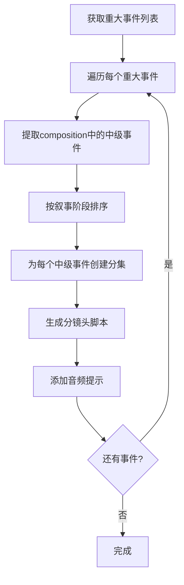

# 视频生成系统 - 第一阶段实现方案

> **基于中级事件的分集拆分与音频同步设计**
> 
> 设计时间：2025-12-31  
> 版本：v1.0  
> 状态：待审核

---

## 1. 概述

### 1.1 目标

根据现有设计文档，实现视频生成系统的第一阶段核心功能：

1. **第一阶段小说筛选** - 只显示已完成第一阶段设定的小说
2. **中级事件分集** - 按每个中级事件作为一集拆分
3. **音频同步设计** - 为每个镜头设计同步的音频提示

### 1.2 核心原则

```
重大事件 → 包含多个中级事件 → 每个中级事件 = 一集视频
```

---

## 2. 数据结构分析

### 2.1 现有事件结构

```json
{
  "name": "重大事件名称",
  "chapter_range": "1-10章",
  "composition": {
    "起因": [
      {"name": "中级事件1", "chapter": 1, "description": "..."},
      {"name": "中级事件2", "chapter": 2, "description": "..."}
    ],
    "发展": [
      {"name": "中级事件3", "chapter": 5, "description": "..."}
    ],
    "高潮": [
      {"name": "中级事件4", "chapter": 8, "description": "..."}
    ],
    "结局": [
      {"name": "中级事件5", "chapter": 10, "description": "..."}
    ]
  }
}
```

### 2.2 中级事件提取逻辑

```python
# 从重大事件的composition中提取所有中级事件
def extract_medium_events(major_event):
    medium_events = []
    
    composition = major_event.get("composition", {})
    
    # 按叙事顺序提取：起因 → 发展 → 高潮 → 结局
    for stage in ["起因", "发展", "高潮", "结局"]:
        events = composition.get(stage, [])
        for event in events:
            medium_events.append({
                **event,
                "stage": stage,
                "parent_major_event": major_event.get("name"),
                "chapter": event.get("chapter", major_event.get("_start_chapter"))
            })
    
    return medium_events
```

---

## 3. 分集拆分方案

### 3.1 分集单元设计

每个分集（Episode）对应一个中级事件：

```python
@dataclass
class Episode:
    """分集单元"""
    episode_number: int           # 分集序号
    major_event_name: str         # 所属重大事件
    medium_event_name: str        # 中级事件名称
    stage: str                    # 叙事阶段（起因/发展/高潮/结局）
    chapter: int                  # 所在章节
    
    # 分镜头内容
    storyboard: Dict             # 分镜头脚本
    
    # 时长估算
    estimated_duration: float    # 预估时长（秒）
```

### 3.2 分集计算流程



### 3.3 镜头数量分配策略

根据中级事件的叙事阶段分配镜头数量：

| 叙事阶段 | 镜头数量 | 平均时长 | 节奏特点 |
|---------|---------|---------|---------|
| 起因 | 5-7个 | 30-45秒 | 缓慢建立 |
| 发展 | 8-10个 | 45-60秒 | 逐步推进 |
| 高潮 | 10-15个 | 60-90秒 | 紧张密集 |
| 结局 | 4-6个 | 30-45秒 | 收束留白 |

---

## 4. 音频同步设计

### 4.1 音频提示结构

每个镜头包含完整的音频提示：

```json
{
  "shot_number": 1,
  "description": "镜头描述",
  
  // 音频同步设计
  "audio_design": {
    "background_music": {
      "type": "紧张/舒缓/激昂",
      "volume": "低/中/高",
      "fade_in": "0.5秒",
      "fade_out": "0.3秒"
    },
    "sound_effects": [
      {
        "effect": "环境音/动作音/特殊音效",
        "timing": "0s",           // 在镜头中触发时间
        "duration": "持续"
      }
    ],
    "dialogue": {
      "has_dialogue": true,
      "speaker": "角色名",
      "tone": "语气描述",
      "suggested_text": "建议对白"
    },
    "atmosphere": {
      "mood": "氛围描述",
      "transition": "与上镜头的音频过渡"
    }
  }
}
```

### 4.2 音频生成提示词模板

```python
AUDIO_PROMPT_TEMPLATE = """
基于以下镜头信息生成音频提示：

【镜头信息】
- 序号：{shot_number}
- 描述：{description}
- 景别：{shot_type}
- 运镜：{camera_movement}
- 时长：{duration}秒

【音频设计要求】

1. 背景音乐（BGM）
   - 风格：根据{mood}选择{music_style}
   - 音量：{volume}
   - 淡入淡出：{fade_in} / {fade_out}

2. 音效（SFX）
   {sound_effects_list}

3. 对白/旁白（如适用）
   - 说话人：{speaker}
   - 语气：{tone}
   - 建议内容：{suggested_text}

4. 整体氛围
   - 目标情绪：{target_emotion}
   - 与上镜头过渡：{transition}

【输出格式】
生成可直接用于AI音频生成的提示词。
"""
```

### 4.3 音频同步规则

```python
# 音频与视觉的同步规则
AUDIO_SYNC_RULES = {
    "节奏匹配": {
        "快速剪辑": "快节奏音乐，鼓点密集",
        "慢镜头": "舒缓音乐，延音效果",
        "推近镜头": "音量渐强，紧张感上升"
    },
    "情绪匹配": {
        "紧张": "低音，不协和音",
        "温馨": "高音，和弦柔和",
        "悬疑": "间歇性音效，静默对比"
    },
    "场景匹配": {
        "动作场景": "打击音效，重低音",
        "对话场景": "背景音乐低调，突出人声",
        "风景镜头": "环境音为主，自然音乐"
    }
}
```

---

## 5. 第一阶段小说筛选

### 5.1 筛选条件

只有满足以下条件的小说才会出现在视频生成列表中：

```python
def is_eligible_for_video_generation(novel_data: Dict) -> bool:
    """检查小说是否具备视频生成条件"""
    
    # 条件1：必须完成第一阶段设定
    quality_data = novel_data.get("quality_data")
    if not quality_data:
        return False
    
    # 条件2：必须有完整的stage_writing_plans
    stage_plans = novel_data.get("stage_writing_plans", {})
    if not stage_plans:
        return False
    
    # 条件3：至少有一个阶段包含major_events
    for stage_name, stage_data in stage_plans.items():
        plan = stage_data.get("stage_writing_plan", {})
        events = plan.get("event_system", {}).get("major_events", [])
        if events:
            return True
    
    return False
```

### 5.2 API接口修改

```python
@video_api.route('/video/novels', methods=['GET'])
@login_required
def get_eligible_novels():
    """
    获取可用于视频生成的小说列表
    只返回已完成第一阶段的小说
    """
    
    # 获取所有小说
    all_novels = manager.list_novels()
    
    # 筛选符合条件的
    eligible_novels = [
        novel for novel in all_novels
        if is_eligible_for_video_generation(novel)
    ]
    
    # 为每个小说添加视频就绪信息
    for novel in eligible_novels:
        novel["video_ready"] = True
        novel["total_medium_events"] = count_medium_events(novel)
        novel["estimated_episodes"] = estimate_episodes(novel)
    
    return jsonify({
        "success": True,
        "novels": eligible_novels,
        "total": len(eligible_novels)
    })
```

---

## 6. LongSeriesStrategy 修改方案

### 6.1 新的分集分配方法

```python
class LongSeriesStrategy(VideoGenerationStrategy):
    """
    长篇剧集策略 - 基于中级事件分集
    
    每个中级事件 = 一集
    """
    
    def allocate_content(self, all_events: List[Dict], total_units: int = None) -> List[Dict]:
        """
        基于中级事件分配分集
        
        Args:
            all_events: 所有重大事件列表
            total_units: 忽略此参数，自动计算
        
        Returns:
            分集列表
        """
        self.logger.info(f"📺 长剧集模式：从{len(all_events)}个重大事件中提取中级事件")
        
        episodes = []
        episode_number = 0
        
        # 遍历所有重大事件
        for major_event in all_events:
            major_event_name = major_event.get("name", "")
            chapter_range = major_event.get("chapter_range", "")
            
            # 提取中级事件
            medium_events = self._extract_medium_events(major_event)
            
            # 为每个中级事件创建一集
            for medium_event in medium_events:
                episode_number += 1
                
                episodes.append({
                    "episode_number": episode_number,
                    "episode_type": "分集",
                    
                    # 关联信息
                    "major_event_name": major_event_name,
                    "medium_event_name": medium_event.get("name", ""),
                    "stage": medium_event.get("stage", ""),
                    "chapter": medium_event.get("chapter", 0),
                    "chapter_range": chapter_range,
                    
                    # 内容
                    "major_event": major_event,
                    "medium_event": medium_event,
                    
                    # 时长估算（根据叙事阶段）
                    "estimated_duration_minutes": self._estimate_episode_duration(
                        medium_event.get("stage", "")
                    )
                })
        
        self.logger.info(f"✅ 分配完成：{len(episodes)} 集")
        return episodes
    
    def _extract_medium_events(self, major_event: Dict) -> List[Dict]:
        """从重大事件中提取中级事件"""
        medium_events = []
        
        composition = major_event.get("composition", {})
        
        # 按叙事顺序提取
        stage_order = ["起因", "发展", "高潮", "结局"]
        
        for stage in stage_order:
            events = composition.get(stage, [])
            for event in events:
                medium_events.append({
                    **event,
                    "stage": stage,
                    "parent_major_event": major_event.get("name")
                })
        
        return medium_events
    
    def _estimate_episode_duration(self, stage: str) -> float:
        """根据叙事阶段估算分集时长"""
        duration_map = {
            "起因": 2.5,   # 2.5分钟
            "发展": 4.0,   # 4分钟
            "高潮": 5.0,   # 5分钟
            "结局": 2.0    # 2分钟
        }
        return duration_map.get(stage, 3.0)
```

### 6.2 镜头序列生成增强

```python
def generate_shot_sequence(self, event: Dict, context: Dict) -> List[Dict]:
    """
    为中级事件生成镜头序列（包含完整音频设计）
    """
    stage = context.get("stage", "发展")
    shots = []
    
    # 根据叙事阶段确定镜头数量和节奏
    shot_config = self._get_shot_config(stage)
    
    shot_number = 0
    
    # 1. 开场镜头（如果需要）
    if shot_config["needs_opening"]:
        shot_number += 1
        shots.append(self._create_opening_shot(shot_number, event, context))
    
    # 2. 主要镜头序列
    for i in range(shot_config["main_shots"]):
        shot_number += 1
        shots.append(self._create_main_shot(
            shot_number, i, event, context, stage
        ))
    
    # 3. 结尾镜头
    if shot_config["needs_ending"]:
        shot_number += 1
        shots.append(self._create_ending_shot(shot_number, event, context))
    
    return shots

def _create_main_shot(self, shot_number: int, index: int, 
                     event: Dict, context: Dict, stage: str) -> Dict:
    """创建主要镜头（包含音频设计）"""
    
    # 基础镜头信息
    shot = {
        "shot_number": shot_number,
        "shot_type": self._select_shot_type(index, stage),
        "camera_movement": self._select_camera_movement(index, stage),
        "duration_seconds": self._calculate_shot_duration(stage),
        "description": self._generate_shot_description(event, index, stage),
        "visual_focus": self._get_visual_focus(stage),
    }
    
    # 添加音频同步设计
    shot["audio_design"] = self._generate_audio_design(shot, event, stage)
    
    return shot

def _generate_audio_design(self, shot: Dict, event: Dict, stage: str) -> Dict:
    """生成音频同步设计"""
    
    shot_type = shot["shot_type"]
    duration = shot["duration_seconds"]
    
    return {
        "background_music": {
            "type": self._select_bgm_type(stage, shot_type),
            "volume": self._select_bgm_volume(stage),
            "fade_in": "0.5s",
            "fade_out": "0.3s",
            "prompt": self._generate_bgm_prompt(stage, shot_type)
        },
        "sound_effects": self._generate_sound_effects(shot, event, stage),
        "atmosphere": {
            "mood": self._get_mood(stage),
            "transition": self._get_audio_transition(shot["shot_number"]),
            "sync_points": self._generate_sync_points(shot)
        },
        # AI生成提示词
        "generation_prompt": self._generate_audio_prompt(shot, event, stage)
    }

def _generate_audio_prompt(self, shot: Dict, event: Dict, stage: str) -> str:
    """生成AI音频生成提示词"""
    
    bgm_type = shot["audio_design"]["background_music"]["type"]
    mood = shot["audio_design"]["atmosphere"]["mood"]
    
    prompt = f"""音频生成请求 - 镜头{shot['shot_number']}

视觉描述：
{shot['description']}

音频要求：
- 背景音乐：{bgm_type}风格，{shot['audio_design']['background_music']['volume']}音量
- 氛围：{mood}
- 时长：{shot['duration_seconds']}秒

同步点：
{self._format_sync_points(shot['audio_design']['atmosphere']['sync_points'])}

注意：音频应与镜头节奏和情绪完美匹配。"""
    
    return prompt
```

---

## 7. API 接口设计

### 7.1 获取可用的小说列表

```
GET /api/video/novels

Response:
{
  "success": true,
  "novels": [
    {
      "title": "小说标题",
      "video_ready": true,
      "total_medium_events": 45,
      "estimated_episodes": 45,
      "total_duration_minutes": 180
    }
  ]
}
```

### 7.2 基于中级事件生成分镜头

```
POST /api/video/generate-medium-episodes

Request:
{
  "title": "小说标题",
  "video_type": "long_series",
  "mode": "medium_events"  // 新增：指定使用中级事件模式
}

Response:
{
  "success": true,
  "mode": "medium_events",
  "total_episodes": 45,
  "episodes": [
    {
      "episode_number": 1,
      "major_event_name": "重大事件1",
      "medium_event_name": "中级事件1",
      "stage": "起因",
      "storyboard": {
        "scenes": [...],
        "total_shots": 7,
        "total_duration_seconds": 150
      },
      "audio_design": {...}
    }
  ]
}
```

---

## 8. 前端界面改进

### 8.1 小说选择界面

```html
<div class="novel-selector">
  <div class="novel-list" id="eligibleNovels">
    <!-- 只显示符合条件的小说 -->
    <div class="novel-item video-ready">
      <h3>小说标题</h3>
      <div class="video-stats">
        <span>📊 中级事件: 45个</span>
        <span>🎬 预计分集: 45集</span>
        <span>⏱️ 总时长: 180分钟</span>
      </div>
    </div>
  </div>
</div>
```

### 8.2 分集预览界面

```html
<div class="episode-list">
  <div class="episode-item">
    <div class="episode-header">
      <span class="episode-number">第1集</span>
      <span class="episode-stage badge-起因">起因</span>
    </div>
    <h4>中级事件名称</h4>
    <p>所属：重大事件名称</p>
    <div class="episode-stats">
      <span>🎬 镜头: 7个</span>
      <span>⏱️ 时长: 2.5分钟</span>
      <span>🎵 音频: 已设计</span>
    </div>
  </div>
</div>
```

---

## 9. 实施计划

### 9.1 修改的文件

| 文件 | 修改内容 |
|-----|---------|
| `src/managers/VideoAdapterManager.py` | 修改LongSeriesStrategy，添加中级事件提取逻辑 |
| `web/api/video_generation_api.py` | 添加小说筛选接口，修改分集生成接口 |
| `web/templates/video-generation.html` | 更新UI显示中级事件信息 |
| `web/static/js/video-generation.js` | 添加中级事件模式的前端逻辑 |

### 9.2 实施步骤

1. **修改LongSeriesStrategy** - 添加中级事件提取和分集逻辑
2. **增强音频设计** - 为每个镜头添加完整的音频提示
3. **修改API接口** - 添加小说筛选和新模式支持
4. **更新前端** - 显示中级事件信息
5. **测试验证** - 确保功能正常工作
6. **更新文档** - 记录新功能使用方法

---

## 10. 验收标准

- [ ] 只有完成第一阶段的小说出现在列表
- [ ] 每个中级事件正确拆分为一集
- [ ] 每集包含完整的分镜头脚本
- [ ] 每个镜头包含音频同步设计
- [ ] API正确返回中级事件模式数据
- [ ] 前端正确显示分集信息

---

**文档所有者**：Kilo Code  
**状态**：待用户审核  
**下一步**：审核通过后开始实施