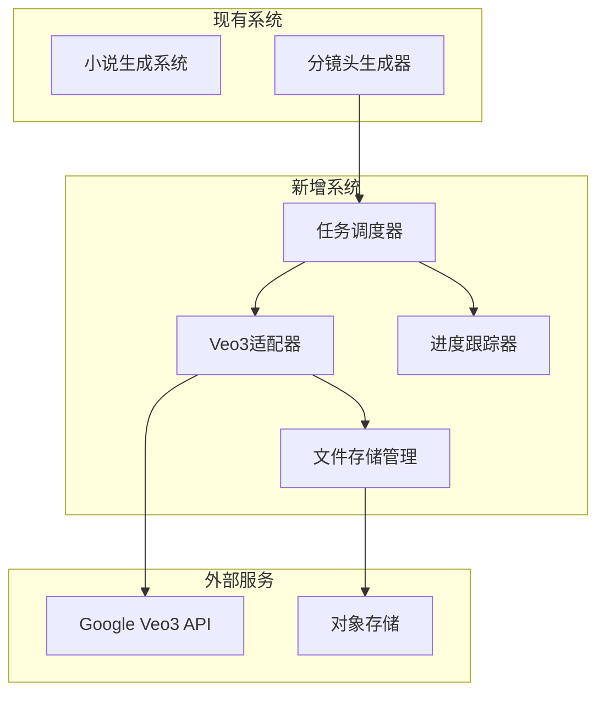
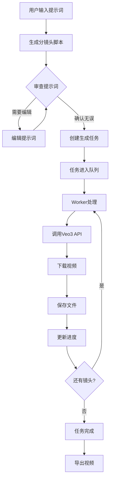
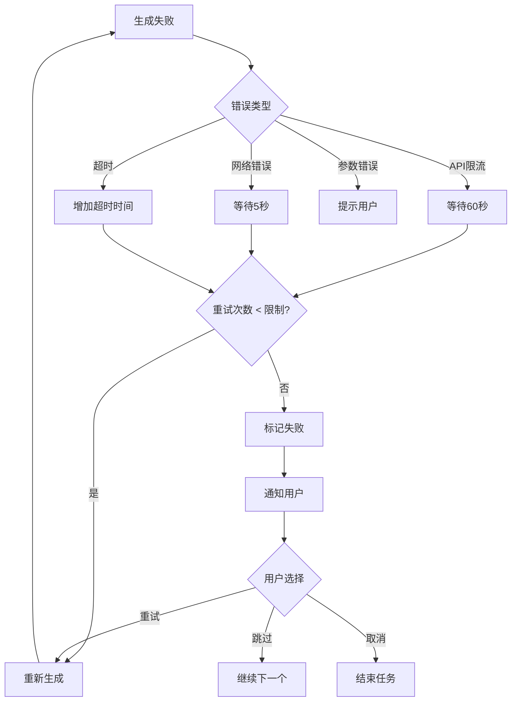

# 视频生成系统总体设计文档

> **基于 Google Veo3 的企业级视频生成系统 - 完整设计方案**
> 
> 项目代号：Veo3-Video-Gen  
> 设计时间：2025-12-31  
> 版本：v1.0  
> 预计工期：6周

---

## 文档说明

本文档是视频生成系统的**完整总体设计**，整合了所有架构设计内容，作为项目实施的唯一权威参考。

**文档结构**：
1. 项目概述
2. 需求分析
3. 系统架构
4. 详细设计
5. 实施计划
6. 附录

---

## 第一部分：项目概述

### 1.1 项目背景

当前系统已具备：
- ✅ 完善的小说生成系统
- ✅ 分镜头脚本生成能力（[`VideoAdapterManager`](../src/managers/VideoAdapterManager.py)）
- ✅ 前端视频生成界面（[`video-generation.html`](../web/templates/video-generation.html)）

**待实现**：
- ❌ 真实的视频生成能力（当前仅返回模拟数据）
- ❌ 异步任务管理系统
- ❌ 实时进度跟踪
- ❌ 文件存储管理

### 1.2 项目目标

构建一个**基于Google Veo3的企业级视频生成系统**，核心工作流：

```
提示词就绪 → 分镜头脚本 → 逐步生成视频 → 导出成品
```

**核心特性**：
1. **智能分镜头** - 自动将小说/提示词转换为专业分镜头脚本
2. **Veo3集成** - 无缝集成Google Veo3 API（含音频）
3. **异步任务** - 高效处理长时视频生成任务
4. **实时进度** - WebSocket推送生成进度
5. **智能重试** - 自动处理API失败
6. **完整管理** - 项目/任务/文件全生命周期管理

### 1.3 系统边界



---

## 第二部分：需求分析

### 2.1 功能需求

#### FR1: 分镜头脚本生成
- [x] 已实现 - 基于[`VideoAdapterManager`](../src/managers/VideoAdapterManager.py)
- 支持三种视频类型：短片、长剧集、短视频
- 自动生成镜头描述、景别、运镜、音频提示

#### FR2: 视频生成任务管理
- [ ] 待实现 - 创建和管理视频生成任务
- 支持任务提交、启动、暂停、恢复、取消
- 支持批量生成和单个生成
- 任务优先级管理

#### FR3: 镜头逐步生成
- [ ] 待实现 - 逐个镜头调用Veo3 API生成
- 支持并发生成（可配置并发数）
- 每个镜头独立处理，失败不影响其他
- 自动重试失败的镜头

#### FR4: 实时进度跟踪
- [ ] 待实现 - WebSocket推送生成进度
- 显示整体进度和当前镜头进度
- 预估剩余时间
- 显示生成状态和错误信息

#### FR5: 文件存储管理
- [ ] 待实现 - 保存生成的视频文件
- 自动生成缩略图
- 支持本地存储和云存储
- 文件清理策略

#### FR6: 视频导出
- [ ] 待实现 - 导出最终视频
- 支持多种格式（MP4、WebM等）
- 支持质量选择（HD、Full HD等）

### 2.2 非功能需求

#### NFR1: 性能
- 支持100个镜头的项目
- 并发生成3-5个镜头
- 单个镜头生成时间 < 120秒
- API响应时间 < 500ms

#### NFR2: 可靠性
- 任务成功率 > 95%
- 自动重试失败的镜头
- 错误恢复机制
- 数据持久化

#### NFR3: 可扩展性
- 水平扩展Worker
- 支持多种视频生成服务
- 支持多种存储后端

#### NFR4: 安全性
- API密钥安全存储
- 用户数据隔离
- 文件访问控制

---

## 第三部分：系统架构

### 3.1 分层架构

```
┌─────────────────────────────────────────────────────────────┐
│                      前端展示层                              │
│  • 任务监控面板  • 进度实时显示  • 视频预览播放器            │
└─────────────────────────────────────────────────────────────┘
                            ↓
┌─────────────────────────────────────────────────────────────┐
│                      API网关层                               │
│  • RESTful API  • WebSocket服务  • 认证授权                 │
└─────────────────────────────────────────────────────────────┘
                            ↓
┌─────────────────────────────────────────────────────────────┐
│                      业务逻辑层                              │
│  ┌──────────┬──────────┬──────────┬──────────┐             │
│  │任务调度器 │ Veo3适配器 │ 进度跟踪器 │ 文件管理器 │             │
│  └──────────┴──────────┴──────────┴──────────┘             │
└─────────────────────────────────────────────────────────────┘
                            ↓
┌─────────────────────────────────────────────────────────────┐
│                      数据访问层                              │
│  • PostgreSQL  • Redis  • 文件系统                         │
└─────────────────────────────────────────────────────────────┘
                            ↓
┌─────────────────────────────────────────────────────────────┐
│                      外部服务层                              │
│  • Google Veo3 API  • 对象存储 (S3/OSS)                    │
└─────────────────────────────────────────────────────────────┘
```

### 3.2 核心模块

#### 3.2.1 任务调度器 (VideoTaskScheduler)

**职责**：
- 管理任务队列
- 分配镜头给Worker
- 控制并发数量
- 处理任务状态变化

**接口**：
```python
class VideoTaskScheduler:
    async def submit_task(self, task: VideoTask) -> str
    async def assign_shot(self, worker: Worker) -> Optional[Shot]
    async def on_shot_completed(self, task_id: str, shot_index: int, result: VideoGenerationResult)
    async def on_shot_failed(self, task_id: str, shot_index: int, error: Exception)
    async def cancel_task(self, task_id: str) -> bool
    async def get_task_status(self, task_id: str) -> TaskStatus
```

#### 3.2.2 Worker (VideoWorker)

**职责**：
- 执行视频生成任务
- 调用Veo3 API
- 处理生成结果
- 实现重试逻辑

**工作循环**：
```python
while True:
    shot = await scheduler.assign_shot(self)
    if shot:
        try:
            result = await veo3.generate_video(shot)
            await scheduler.on_shot_completed(shot, result)
        except Exception as e:
            await handle_failure(shot, e)
    else:
        await asyncio.sleep(1)
```

#### 3.2.3 Veo3适配器 (Veo3Adapter)

**职责**：
- 封装Veo3 API调用
- 构建请求体
- 处理响应
- 管理限流

**核心流程**：
```python
async def generate_video(self, shot: Shot, config: dict) -> VideoGenerationResult:
    # 1. 构建请求
    request_body = self._build_request(shot, config)
    
    # 2. 提交生成
    generation_id = await self._submit_generation(request_body)
    
    # 3. 轮询状态
    while not done:
        status = await self._get_status(generation_id)
        await asyncio.sleep(5)
    
    # 4. 下载视频
    video_path = await self._download_video(status.video_uri)
    thumbnail_path = await self._generate_thumbnail(video_path)
    
    return VideoGenerationResult(video_path, thumbnail_path)
```

#### 3.2.4 进度跟踪器 (ProgressTracker)

**职责**：
- 记录任务进度
- 计算完成率
- 估算剩余时间
- 广播进度事件

**进度计算**：
```python
overall_progress = (completed_shots / total_shots) + (current_shot_progress / total_shots)

estimated_remaining = avg_time_per_shot * (total_shots - completed_shots)
```

#### 3.2.5 文件存储管理器 (VideoStorageManager)

**职责**：
- 保存生成的视频
- 生成缩略图
- 管理文件URL
- 清理旧文件

**存储结构**：
```
视频项目/
└── {project_id}/
    ├── config.json
    ├── storyboard.json
    ├── shots/
    │   ├── shot_000.mp4
    │   ├── shot_001.mp4
    │   └── ...
    ├── previews/
    │   ├── shot_000_thumb.jpg
    │   └── ...
    └── exports/
        └── final.mp4
```

### 3.3 数据模型

#### 3.3.1 核心实体

```python
@dataclass
class VideoProject:
    """视频项目"""
    project_id: str
    user_id: str
    project_name: str
    video_type: str
    status: ProjectStatus
    total_shots: int
    storyboard: Storyboard
    config: ProjectConfig
    created_at: datetime

@dataclass
class VideoTask:
    """视频生成任务"""
    task_id: str
    project_id: str
    shots: List[Shot]
    status: TaskStatus
    config: TaskConfig
    created_at: datetime
    started_at: Optional[datetime]
    completed_at: Optional[datetime]

@dataclass
class Shot:
    """单个镜头"""
    shot_index: int
    shot_type: str
    camera_movement: str
    duration_seconds: float
    description: str
    generation_prompt: str
    audio_prompt: str
    status: ShotStatus
    video_path: Optional[str]
    thumbnail_path: Optional[str]
    created_at: datetime
```

#### 3.3.2 数据库设计

```sql
-- 视频项目表
CREATE TABLE video_projects (
    project_id UUID PRIMARY KEY,
    user_id VARCHAR(36) NOT NULL,
    project_name VARCHAR(255) NOT NULL,
    video_type VARCHAR(50) NOT NULL,
    status VARCHAR(50) DEFAULT 'created',
    total_shots INT DEFAULT 0,
    storyboard_json JSONB,
    config_json JSONB,
    created_at TIMESTAMP DEFAULT NOW(),
    updated_at TIMESTAMP DEFAULT NOW()
);

-- 视频任务表
CREATE TABLE video_tasks (
    task_id UUID PRIMARY KEY,
    project_id UUID NOT NULL REFERENCES video_projects(project_id),
    total_shots INT NOT NULL,
    completed_shots INT DEFAULT 0,
    failed_shots INT DEFAULT 0,
    status VARCHAR(50) DEFAULT 'pending',
    config_json JSONB,
    created_at TIMESTAMP DEFAULT NOW(),
    started_at TIMESTAMP,
    completed_at TIMESTAMP
);

-- 镜头任务表
CREATE TABLE shot_tasks (
    shot_id UUID PRIMARY KEY,
    task_id UUID NOT NULL REFERENCES video_tasks(task_id),
    shot_index INT NOT NULL,
    prompt TEXT NOT NULL,
    duration FLOAT NOT NULL,
    status VARCHAR(50) DEFAULT 'pending',
    video_path VARCHAR(512),
    thumbnail_path VARCHAR(512),
    error_message TEXT,
    retry_count INT DEFAULT 0,
    created_at TIMESTAMP DEFAULT NOW(),
    started_at TIMESTAMP,
    completed_at TIMESTAMP,
    UNIQUE(task_id, shot_index)
);
```

### 3.4 工作流程

#### 3.4.1 完整生成流程



#### 3.4.2 错误处理流程



---

## 第四部分：详细设计

### 4.1 API接口设计

#### 4.1.1 项目管理API

| 方法 | 端点 | 功能 |
|------|------|------|
| POST | `/api/video/projects` | 创建项目 |
| GET | `/api/video/projects/{id}` | 获取项目详情 |
| GET | `/api/video/projects` | 列出所有项目 |
| DELETE | `/api/video/projects/{id}` | 删除项目 |
| POST | `/api/video/projects/{id}/export` | 导出项目 |

#### 4.1.2 任务管理API

| 方法 | 端点 | 功能 |
|------|------|------|
| POST | `/api/video/tasks` | 创建任务 |
| POST | `/api/video/tasks/{id}/start` | 启动任务 |
| POST | `/api/video/tasks/{id}/pause` | 暂停任务 |
| POST | `/api/video/tasks/{id}/resume` | 恢复任务 |
| POST | `/api/video/tasks/{id}/cancel` | 取消任务 |
| GET | `/api/video/tasks/{id}/status` | 获取状态 |
| POST | `/api/video/tasks/{id}/retry` | 重试失败 |

#### 4.1.3 WebSocket接口

**连接端点**：`ws://localhost:5000/ws/video/{task_id}`

**消息类型**：
- `progress` - 进度更新
- `shot_started` - 镜头开始
- `shot_completed` - 镜头完成
- `shot_failed` - 镜头失败
- `task_completed` - 任务完成
- `task_failed` - 任务失败

### 4.2 技术栈

#### 4.2.1 后端技术

| 技术 | 版本 | 用途 |
|------|------|------|
| Python | 3.10+ | 主要开发语言 |
| Flask | 2.3+ | Web框架 |
| Celery | 5.3+ | 异步任务队列 |
| Redis | 7.0+ | 消息代理 |
| PostgreSQL | 14+ | 数据库 |
| SQLAlchemy | 2.0+ | ORM |
| httpx | 0.24+ | 异步HTTP客户端 |
| ffmpeg-python | 0.2+ | 视频处理 |

#### 4.2.2 前端技术

| 技术 | 版本 | 用途 |
|------|------|------|
| JavaScript | ES2022 | 主要语言 |
| WebSocket API | - | 实时通信 |
| Video.js | 8.0+ | 视频播放器 |

#### 4.2.3 基础设施

| 技术 | 用途 |
|------|------|
| Docker | 容器化部署 |
| Nginx | 反向代理 |
| S3/OSS | 对象存储（生产环境） |

---

## 第五部分：实施计划

### 5.1 阶段划分

#### Phase 1: 基础架构（Week 1）

**目标**：搭建基础架构框架

**任务**：
1. 数据库设计（2天）
   - 设计ER图
   - 创建SQL建表脚本
   - 实现SQLAlchemy模型

2. 核心数据模型（2天）
   - 实现`VideoProject`类
   - 实现`VideoTask`类
   - 实现`Shot`类
   - 实现序列化/反序列化

3. Veo3适配器（3天）
   - 实现`Veo3Adapter`类
   - API请求构建
   - 响应解析
   - 错误处理
   - 限流控制
   - 单元测试

**交付物**：
- 数据库表创建完成
- 核心数据模型实现
- Veo3适配器实现并测试通过
- 单元测试覆盖率 > 80%

#### Phase 2: 任务调度系统（Week 2）

**目标**：实现异步任务调度

**任务**：
1. 任务调度器（3天）
   - 实现`VideoTaskScheduler`类
   - 任务队列管理
   - Worker池管理
   - 并发控制
   - 任务状态管理

2. Worker实现（3天）
   - 实现`VideoWorker`类
   - 镜头生成逻辑
   - 进度报告
   - 错误处理
   - 重试机制

3. Celery集成（2天）
   - Celery配置
   - Celery任务定义
   - Worker启动脚本
   - 监控配置

**交付物**：
- 任务调度器实现
- Worker实现并运行
- Celery集成完成
- 能够处理多个镜头的串行生成

#### Phase 3: 进度与存储（Week 3）

**目标**：实现进度跟踪和文件存储

**任务**：
1. 进度跟踪系统（3天）
   - 实现`ProgressTracker`类
   - 进度计算
   - 时间估算
   - 事件记录

2. WebSocket服务（2天）
   - WebSocket路由
   - 消息广播
   - 连接管理
   - 前端集成

3. 文件存储管理（3天）
   - 实现`VideoStorageManager`类
   - 本地存储实现
   - S3存储适配器
   - 文件清理策略

**交付物**：
- 进度跟踪系统实现
- WebSocket服务实现
- 文件存储管理实现
- 前端能够实时接收进度更新

#### Phase 4: API与前端（Week 4）

**目标**：实现API和前端界面

**任务**：
1. API接口实现（3天）
   - 项目管理API
   - 任务管理API
   - 视频生成API
   - 错误处理中间件

2. 前端界面更新（4天）
   - 任务监控面板
   - 进度显示组件
   - WebSocket客户端
   - 视频预览播放器

3. 集成测试（2天）
   - 测试用例编写
   - 测试执行
   - Bug修复

**交付物**：
- 所有API实现
- 前端界面更新
- 端到端流程测试通过

#### Phase 5: 优化与部署（Week 5-6）

**目标**：优化系统并部署上线

**任务**：
1. 性能优化（2天）
   - 数据库查询优化
   - 缓存策略
   - 并发控制调优
   - 文件I/O优化

2. 错误处理完善（2天）
   - 全局异常处理
   - 错误日志记录
   - 用户友好的错误提示
   - 监控告警

3. 文档完善（2天）
   - API文档
   - 部署文档
   - 用户手册
   - 开发者指南

4. 部署上线（1天）
   - 生产环境配置
   - Docker镜像构建
   - 服务部署
   - 监控配置

**交付物**：
- 性能优化完成
- 错误处理完善
- 文档齐全
- 生产环境部署

### 5.2 里程碑

| 里程碑 | 时间 | 验收标准 |
|--------|------|----------|
| M1: 基础架构 | Week 1结束 | 能够调用Veo3生成单个视频 |
| M2: 任务调度 | Week 2结束 | 能够批量处理多个镜头 |
| M3: 进度跟踪 | Week 3结束 | 用户能实时看到进度 |
| M4: 系统集成 | Week 4结束 | 完整流程测试通过 |
| M5: 生产部署 | Week 5-6结束 | 系统稳定运行 |

---

## 第六部分：附录

### 附录A：文件结构

```
项目根目录/
├── src/
│   ├── models/
│   │   ├── video_project_model.py
│   │   ├── video_task_model.py
│   │   └── shot_model.py
│   ├── schedulers/
│   │   └── video_task_scheduler.py
│   ├── workers/
│   │   └── video_worker.py
│   ├── services/
│   │   ├── veo3_adapter.py
│   │   ├── progress_tracker.py
│   │   ├── video_storage_manager.py
│   │   └── rate_limiter.py
│   ├── websocket/
│   │   └── video_progress_ws.py
│   └── api/
│       ├── video_projects_api.py
│       └── video_tasks_api.py
├── web/
│   ├── templates/
│   │   └── video-generation-v2.html
│   └── static/
│       ├── js/
│       │   └── video-generation-v2.js
│       └── css/
│           └── video-generation-v2.css
├── migrations/
│   └── create_video_tables.sql
├── tests/
│   ├── test_veo3_adapter.py
│   ├── test_scheduler.py
│   ├── test_worker.py
│   └── test_integration.py
├── scripts/
│   └── start_celery_worker.sh
├── docs/
│   ├── VIDEO_GENERATION_ARCHITECTURE.md
│   ├── VIDEO_GENERATION_WORKFLOW.md
│   ├── VIDEO_GENERATION_API_DESIGN.md
│   ├── VIDEO_GENERATION_IMPLEMENTATION_PLAN.md
│   └── VIDEO_GENERATION_ARCHITECTURE_SUMMARY.md
└── docker-compose.yml
```

### 附录B：配置示例

```python
# config/video_config.py
VIDEO_CONFIG = {
    "veo3": {
        "api_key": os.getenv("VEO3_API_KEY"),
        "base_url": "https://generativelanguage.googleapis.com/v1beta",
        "model": "veo-2.0-generate-001",
        "timeout": 300,
        "max_retries": 3
    },
    "task": {
        "max_concurrent": 3,
        "retry_limit": 3,
        "retry_delay": 60,
        "task_timeout": 3600
    },
    "storage": {
        "type": "local",
        "base_path": "视频项目"
    },
    "rate_limit": {
        "requests_per_minute": 10
    }
}
```

### 附录C：错误码定义

| 错误码 | 说明 | HTTP状态码 |
|--------|------|-----------|
| `INVALID_PARAMS` | 请求参数无效 | 400 |
| `PROJECT_NOT_FOUND` | 项目不存在 | 404 |
| `TASK_NOT_FOUND` | 任务不存在 | 404 |
| `VEO3_API_ERROR` | Veo3 API调用失败 | 500 |
| `VEO3_RATE_LIMIT` | Veo3 API限流 | 429 |
| `VEO3_TIMEOUT` | Veo3 API超时 | 504 |
| `STORAGE_ERROR` | 文件存储失败 | 500 |
| `TASK_CANCELLED` | 任务已取消 | 409 |

### 附录D：监控指标

| 指标 | 说明 | 告警阈值 |
|------|------|----------|
| 任务成功率 | 成功任务/总任务 | < 95% |
| 平均生成时间 | 单个镜头平均耗时 | > 120秒 |
| API错误率 | API调用失败率 | > 5% |
| 存储使用量 | 已用存储空间 | > 80% |
| 队列深度 | 待处理任务数 | > 100 |

---

## 文档版本历史

| 版本 | 日期 | 作者 | 变更说明 |
|------|------|------|----------|
| v1.0 | 2025-12-31 | Kilo Code | 初始版本，完整总体设计 |

---

**文档所有者**：Kilo Code  
**审核状态**：待审核  
**下次评审**：实施启动前

**联系方式**：如有问题或建议，请创建Issue或Pull Request