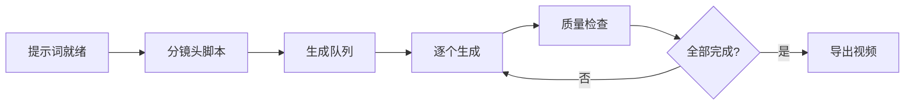
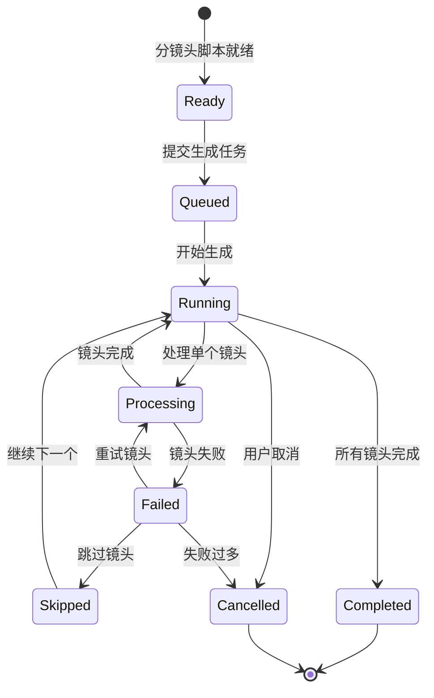
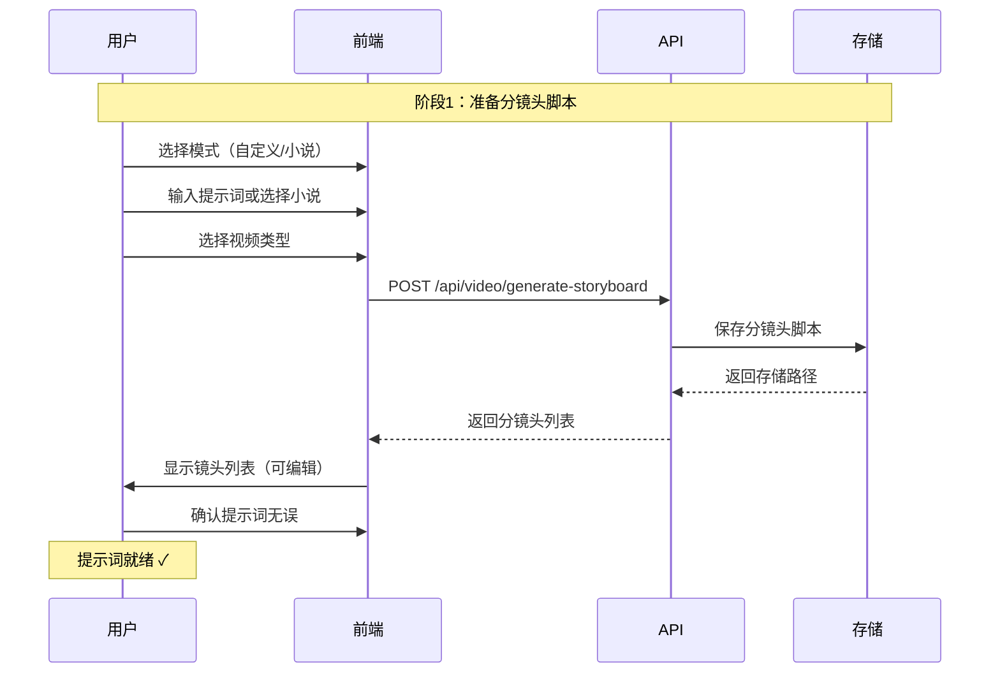
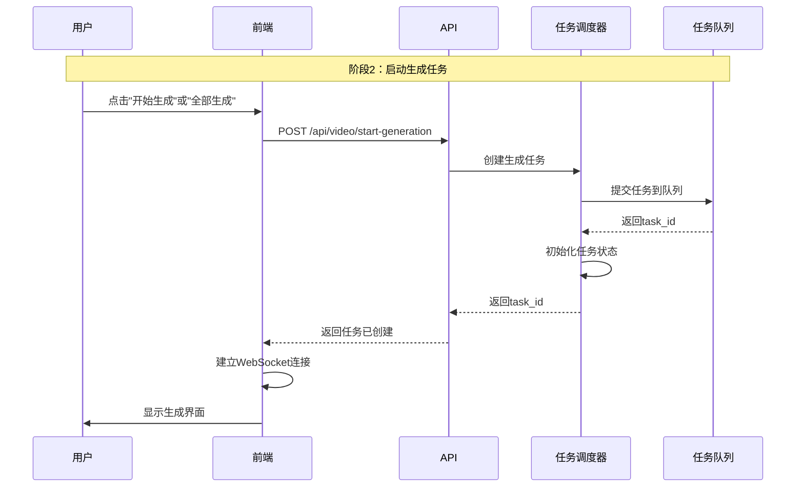
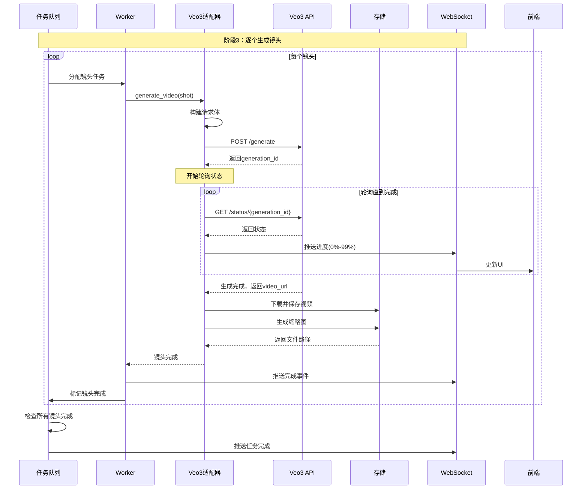
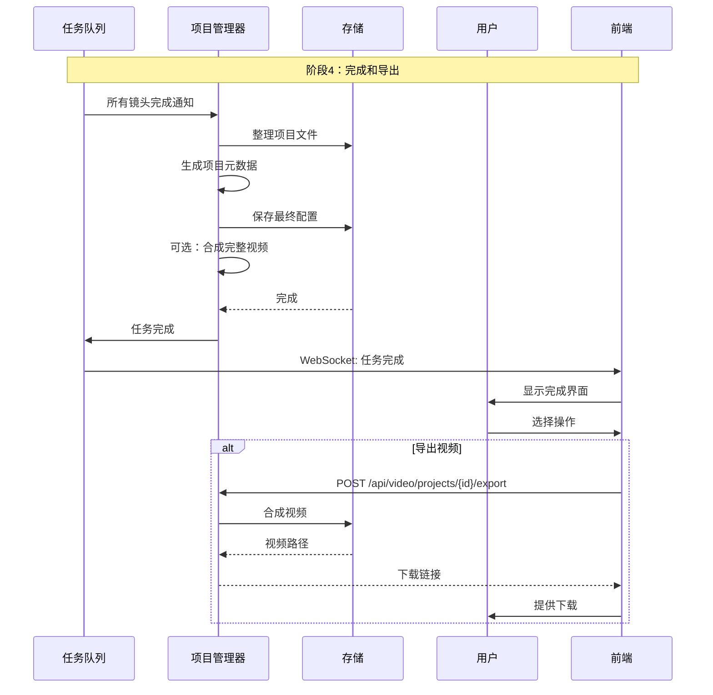
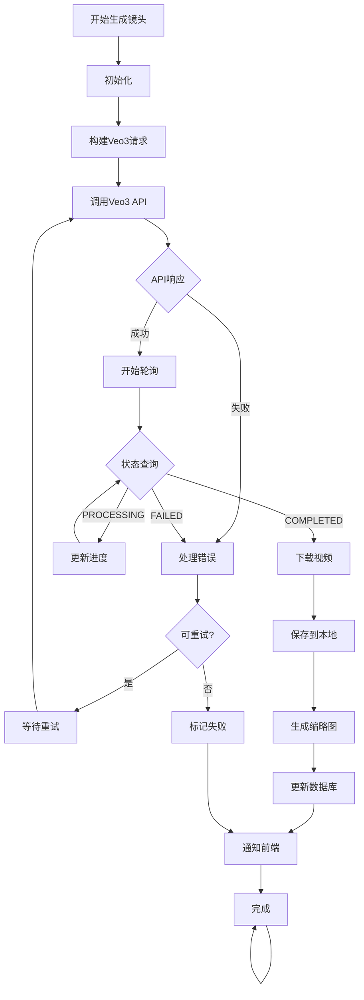
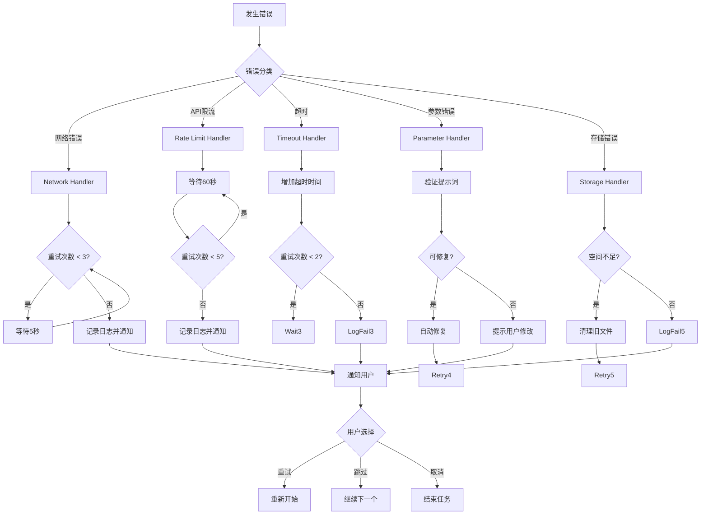

# 分镜头脚本到视频生成工作流设计

> **核心工作流：提示词就绪 → 分镜头脚本 → 逐步生成视频**
> 
> 设计时间：2025-12-31
> 版本：v1.0

---

## 📋 目录

1. [工作流概述](#工作流概述)
2. [核心概念定义](#核心概念定义)
3. [完整工作流程](#完整工作流程)
4. [镜头生成详解](#镜头生成详解)
5. [任务调度策略](#任务调度策略)
6. [错误处理机制](#错误处理机制)
7. [进度跟踪设计](#进度跟踪设计)
8. [用户交互流程](#用户交互流程)

---

## 工作流概述

### 核心理念

```
┌─────────────────────────────────────────────────────────────┐
│                    视频生成工作流                              │
│                                                              │
│  用户输入提示词 → 生成分镜头脚本 → 逐步生成视频 → 导出成品   │
│                                                              │
│  每一步都可控制、可监控、可干预                               │
└─────────────────────────────────────────────────────────────┘
```

### 工作流阶段



### 当前系统状态

| 组件 | 状态 | 说明 |
|------|------|------|
| 提示词输入 | ✅ 完成 | 前端已支持自定义/小说模式 |
| 分镜头生成 | ✅ 完成 | [`generate-storyboard`](../web/api/video_generation_api.py:170) 已实现 |
| 镜头列表显示 | ✅ 完成 | [`renderShotsList()`](../web/static/js/video-generation.js:382) 已实现 |
| 视频生成 | ⚠️ 待实现 | 需集成Veo3 API |
| 任务调度 | ❌ 待实现 | 需要任务队列系统 |
| 进度跟踪 | ❌ 待实现 | 需要WebSocket推送 |

---

## 核心概念定义

### 1. 分镜头脚本

**定义**：将故事分解为一系列镜头的详细描述文档

```python
@dataclass
class Storyboard:
    """分镜头脚本"""
    project_id: str              # 项目ID
    video_type: str              # 视频类型
    total_shots: int             # 总镜头数
    shots: List[Shot]            # 镜头列表
    total_duration: float        # 总时长（秒）
    
    # 元数据
    created_at: datetime
    visual_style: dict           # 视觉风格
    audio_guide: dict            # 音频指导

@dataclass
class Shot:
    """单个镜头"""
    shot_index: int              # 镜头编号（从0开始）
    shot_number: int             # 显示编号（从1开始）
    shot_type: str               # 景别（全景/中景/特写等）
    camera_movement: str         # 运镜（固定/推近/拉远等）
    duration_seconds: float      # 时长
    description: str             # 场景描述
    
    # Veo3生成参数
    generation_prompt: str       # 完整生成提示词
    audio_prompt: str            # 音频提示词
    
    # 生成结果
    status: ShotStatus           # pending/processing/completed/failed
    video_path: Optional[str]    # 生成的视频路径
    thumbnail_path: Optional[str] # 缩略图路径
    error_message: Optional[str] # 错误信息
    
    # 时间戳
    created_at: datetime
    started_at: Optional[datetime]
    completed_at: Optional[datetime]
```

### 2. 生成任务

**定义**：管理视频生成过程的任务单元

```python
@dataclass
class VideoGenerationTask:
    """视频生成任务"""
    task_id: str                 # 任务唯一ID
    project_id: str              # 所属项目
    storyboard: Storyboard       # 关联的分镜头脚本
    
    # 任务状态
    status: TaskStatus           # pending/running/completed/failed/cancelled
    current_shot_index: int      # 当前正在生成的镜头
    completed_count: int         # 已完成数量
    failed_count: int            # 失败数量
    
    # 配置
    config: TaskConfig           # 任务配置
    
    # 结果
    output_video: Optional[str]  # 最终输出视频
    
    # 时间
    created_at: datetime
    started_at: Optional[datetime]
    completed_at: Optional[datetime]

@dataclass
class TaskConfig:
    """任务配置"""
    concurrent_limit: int = 3    # 并发生成数量
    retry_limit: int = 3         # 失败重试次数
    retry_delay: int = 60        # 重试延迟（秒）
    enable_audio: bool = True    # 是否启用音频
    video_quality: str = "HD"    # 视频质量
    aspect_ratio: str = "16:9"   # 宽高比
```

### 3. 工作流状态机



---

## 完整工作流程

### 阶段1：准备阶段



**关键点**：
- 用户可以逐个镜头查看和编辑提示词
- 确认每个镜头的描述准确无误
- 系统验证所有镜头的提示词完整性

### 阶段2：启动生成



**关键点**：
- 任务立即创建并返回task_id
- 用户可以立即看到任务状态
- WebSocket连接用于实时进度推送

### 阶段3：逐步生成



**关键点**：
- 每个镜头独立处理，互不干扰
- 实时推送进度到前端
- 支持并发生成多个镜头
- 失败自动重试

### 阶段4：完成导出



---

## 镜头生成详解

### 单个镜头生成流程



### Veo3请求构建

```python
def build_veo3_request(shot: Shot, config: TaskConfig) -> dict:
    """
    构建Veo3 API请求体
    
    核心要点：
    1. 提示词要包含场景描述、镜头类型、运镜
    2. 音频提示词要描述音乐类型和氛围
    3. 配置要设置时长、宽高比、质量
    """
    
    # 构建文本提示词
    text_prompt = f"""{shot.description}

镜头类型：{shot.shot_type}
运镜方式：{shot.camera_movement}
时长：{shot.duration_seconds}秒

视觉风格：
- 保持与前后镜头的连贯性
- 符合{config.aspect_ratio}宽高比
- {config.video_quality}画质
"""
    
    # 构建音频提示词（Veo3支持）
    audio_prompt = f"""音乐风格：根据场景情绪匹配
音效：添加环境音和动作音效
节奏：与镜头节奏同步
"""
    
    request = {
        "prompt": {
            "text": text_prompt,
            "audio_prompt": audio_prompt
        },
        "generation_config": {
            "duration_seconds": shot.duration_seconds,
            "aspect_ratio": config.aspect_ratio,
            "video_quality": config.video_quality,
            "number_of_videos": 1
        }
    }
    
    return request
```

### API调用示例

```python
import httpx
import asyncio

async def generate_video_with_veo3(
    shot: Shot,
    config: TaskConfig,
    api_key: str
) -> VideoGenerationResult:
    """
    使用Veo3生成单个镜头视频
    """
    
    # 1. 构建请求
    request_body = build_veo3_request(shot, config)
    
    # 2. 调用生成API
    async with httpx.AsyncClient(timeout=300.0) as client:
        response = await client.post(
            "https://generativelanguage.googleapis.com/v1beta/models/veo-2.0-generate-001:predictLongRunning",
            params={"key": api_key},
            json=request_body
        )
        
        if response.status_code != 200:
            raise Veo3APIError(f"API调用失败: {response.text}")
        
        result = response.json()
        generation_id = result["name"]
        
        # 3. 轮询直到完成
        while True:
            status_response = await client.get(
                f"https://generativelanguage.googleapis.com/v1beta/{generation_id}",
                params={"key": api_key}
            )
            
            status = status_response.json()
            state = status.get("done", False)
            
            if state:
                # 生成完成
                video_uri = status["response"]["video"]["uri"]
                break
            
            # 等待后重试
            await asyncio.sleep(5)
        
        # 4. 下载视频
        video_bytes = await client.get(video_uri)
        video_path = save_video_to_storage(shot, video_bytes.content)
        
        # 5. 生成缩略图
        thumbnail_path = generate_thumbnail(video_path)
        
        return VideoGenerationResult(
            shot_index=shot.shot_index,
            video_path=video_path,
            thumbnail_path=thumbnail_path,
            duration=shot.duration_seconds,
            success=True
        )
```

---

## 任务调度策略

### 调度器架构

```python
class VideoTaskScheduler:
    """
    视频生成任务调度器
    
    核心职责：
    - 管理任务队列
    - 控制并发数量
    - 分配Worker任务
    - 处理任务优先级
    """
    
    def __init__(self, config: SchedulerConfig):
        self.config = config
        self.task_queue = PriorityQueue()
        self.active_tasks: Dict[str, VideoGenerationTask] = {}
        self.workers: List[Worker] = []
        
        # 创建Worker池
        for i in range(config.max_workers):
            worker = Worker(worker_id=i, scheduler=self)
            self.workers.append(worker)
    
    async def submit_task(
        self,
        storyboard: Storyboard,
        config: TaskConfig
    ) -> str:
        """
        提交生成任务
        
        Returns:
            task_id: 任务ID
        """
        task = VideoGenerationTask(
            task_id=generate_uuid(),
            storyboard=storyboard,
            config=config,
            status=TaskStatus.QUEUED
        )
        
        # 将任务分解为镜头任务
        for shot in storyboard.shots:
            shot_task = ShotTask(
                shot_id=generate_uuid(),
                shot=shot,
                status=ShotStatus.PENDING
            )
            task.shot_tasks.append(shot_task)
        
        # 加入队列
        await self.task_queue.put(task)
        self.active_tasks[task.task_id] = task
        
        return task.task_id
    
    async def assign_shot_to_worker(
        self,
        worker: Worker
    ) -> Optional[ShotTask]:
        """
        分配镜头任务给Worker
        """
        # 检查并发限制
        active_count = sum(
            1 for task in self.active_tasks.values()
            if task.status == TaskStatus.RUNNING
        )
        
        if active_count >= self.config.max_concurrent:
            return None
        
        # 从队列中获取任务
        task = await self.task_queue.get()
        
        # 找到下一个待处理的镜头
        for shot_task in task.shot_tasks:
            if shot_task.status == ShotStatus.PENDING:
                shot_task.status = ShotStatus.ASSIGNED
                task.status = TaskStatus.RUNNING
                task.current_shot_index = shot_task.shot.shot_index
                return shot_task
        
        return None
    
    async def on_shot_completed(
        self,
        shot_task: ShotTask,
        result: VideoGenerationResult
    ):
        """
        镜头完成回调
        """
        shot_task.status = ShotStatus.COMPLETED
        shot_task.video_path = result.video_path
        shot_task.thumbnail_path = result.thumbnail_path
        shot_task.completed_at = datetime.now()
        
        # 更新任务统计
        task = self.active_tasks[shot_task.task_id]
        task.completed_count += 1
        
        # 检查是否全部完成
        if task.completed_count == len(task.shot_tasks):
            await self._finalize_task(task)
    
    async def on_shot_failed(
        self,
        shot_task: ShotTask,
        error: Exception
    ):
        """
        镜头失败回调
        """
        shot_task.status = ShotStatus.FAILED
        shot_task.error_message = str(error)
        shot_task.retry_count += 1
        
        task = self.active_tasks[shot_task.task_id]
        task.failed_count += 1
        
        # 检查是否需要重试
        if shot_task.retry_count < task.config.retry_limit:
            # 延迟后重试
            await asyncio.sleep(task.config.retry_delay)
            shot_task.status = ShotStatus.PENDING
            await self.task_queue.put(task)
        else:
            # 重试次数用尽
            if task.failed_count > len(task.shot_tasks) * 0.5:
                # 失败超过50%，标记任务失败
                task.status = TaskStatus.FAILED
```

### Worker工作流程

```python
class Worker:
    """
    视频生成Worker
    
    每个Worker独立处理镜头生成任务
    """
    
    def __init__(
        self,
        worker_id: int,
        scheduler: VideoTaskScheduler,
        veo3_adapter: Veo3Adapter
    ):
        self.worker_id = worker_id
        self.scheduler = scheduler
        self.veo3 = veo3_adapter
        self.current_shot: Optional[ShotTask] = None
    
    async def run(self):
        """
        Worker主循环
        """
        while True:
            # 1. 获取任务
            shot_task = await self.scheduler.assign_shot_to_worker(self)
            
            if shot_task is None:
                # 没有任务，等待
                await asyncio.sleep(1)
                continue
            
            self.current_shot = shot_task
            
            try:
                # 2. 生成视频
                shot_task.status = ShotStatus.PROCESSING
                shot_task.started_at = datetime.now()
                
                result = await self.veo3.generate_video(
                    shot=shot_task.shot,
                    config=shot_task.config
                )
                
                # 3. 成功回调
                await self.scheduler.on_shot_completed(shot_task, result)
                
            except Exception as e:
                # 4. 失败回调
                await self.scheduler.on_shot_failed(shot_task, e)
            
            finally:
                self.current_shot = None
```

---

## 错误处理机制

### 错误分类

```python
class VideoGenerationError(Exception):
    """视频生成错误基类"""
    pass

class Veo3APIError(VideoGenerationError):
    """Veo3 API错误"""
    pass

class RateLimitError(Veo3APIError):
    """API限流错误"""
    pass

class TimeoutError(VideoGenerationError):
    """超时错误"""
    pass

class StorageError(VideoGenerationError):
    """存储错误"""
    pass

class InvalidPromptError(VideoGenerationError):
    """无效提示词错误"""
    pass
```

### 错误处理策略



### 重试策略配置

```python
@dataclass
class RetryPolicy:
    """重试策略"""
    max_retries: int = 3           # 最大重试次数
    initial_delay: int = 5         # 初始延迟（秒）
    max_delay: int = 300           # 最大延迟（秒）
    backoff_multiplier: float = 2.0 # 退避倍数
    
    def get_delay(self, retry_count: int) -> int:
        """计算延迟时间（指数退避）"""
        delay = self.initial_delay * (self.backoff_multiplier ** retry_count)
        return min(int(delay), self.max_delay)

# 针对不同错误类型的重试策略
RETRY_POLICIES = {
    "network": RetryPolicy(max_retries=3, initial_delay=5),
    "rate_limit": RetryPolicy(max_retries=5, initial_delay=60),
    "timeout": RetryPolicy(max_retries=2, initial_delay=10),
    "storage": RetryPolicy(max_retries=3, initial_delay=5),
    "api_error": RetryPolicy(max_retries=3, initial_delay=10)
}
```

---

## 进度跟踪设计

### 进度数据结构

```python
@dataclass
class GenerationProgress:
    """生成进度"""
    task_id: str
    total_shots: int
    completed_shots: int
    failed_shots: int
    current_shot_index: int
    
    # 当前镜头进度
    current_shot_progress: float  # 0.0 - 1.0
    
    # 整体进度
    overall_progress: float        # 0.0 - 1.0
    
    # 时间估算
    started_at: datetime
    estimated_completion: Optional[datetime]
    estimated_remaining_seconds: int
    
    # 状态
    status_message: str
    updated_at: datetime
    
    def calculate_overall_progress(self) -> float:
        """计算整体进度"""
        if self.total_shots == 0:
            return 0.0
        
        # 已完成镜头占比
        completed_ratio = self.completed_shots / self.total_shots
        
        # 当前镜头进度占比
        if self.completed_shots < self.total_shots:
            current_ratio = self.current_shot_progress / self.total_shots
        else:
            current_ratio = 0.0
        
        return completed_ratio + current_ratio
    
    def estimate_completion_time(self) -> datetime:
        """预估完成时间"""
        if self.completed_shots == 0:
            return None
        
        # 计算平均每个镜头的耗时
        elapsed = (datetime.now() - self.started_at).total_seconds()
        avg_time_per_shot = elapsed / self.completed_shots
        
        # 剩余镜头数量
        remaining = self.total_shots - self.completed_shots
        
        # 估算剩余时间
        remaining_seconds = int(avg_time_per_shot * remaining)
        self.estimated_remaining_seconds = remaining_seconds
        
        # 计算完成时间
        return datetime.now() + timedelta(seconds=remaining_seconds)
```

### WebSocket推送协议

```python
class ProgressMessage:
    """进度消息"""
    
    TYPE_PROGRESS = "progress"
    TYPE_SHOT_STARTED = "shot_started"
    TYPE_SHOT_COMPLETED = "shot_completed"
    TYPE_SHOT_FAILED = "shot_failed"
    TYPE_TASK_COMPLETED = "task_completed"
    TYPE_TASK_FAILED = "task_failed"
    
    @staticmethod
    def create_progress(
        task_id: str,
        progress: GenerationProgress
    ) -> dict:
        """创建进度消息"""
        return {
            "type": ProgressMessage.TYPE_PROGRESS,
            "data": {
                "task_id": task_id,
                "total_shots": progress.total_shots,
                "completed_shots": progress.completed_shots,
                "failed_shots": progress.failed_shots,
                "current_shot_index": progress.current_shot_index,
                "current_shot_progress": progress.current_shot_progress,
                "overall_progress": progress.overall_progress,
                "estimated_remaining": progress.estimated_remaining_seconds,
                "status_message": progress.status_message,
                "timestamp": datetime.now().isoformat()
            }
        }
    
    @staticmethod
    def create_shot_completed(
        task_id: str,
        shot_index: int,
        video_path: str,
        thumbnail_path: str
    ) -> dict:
        """创建镜头完成消息"""
        return {
            "type": ProgressMessage.TYPE_SHOT_COMPLETED,
            "data": {
                "task_id": task_id,
                "shot_index": shot_index,
                "video_url": f"/static/videos/{video_path}",
                "thumbnail_url": f"/static/videos/{thumbnail_path}",
                "timestamp": datetime.now().isoformat()
            }
        }
```

---

## 用户交互流程

### 前端状态管理

```javascript
class VideoGenerationUI {
    constructor() {
        this.taskId = null;
        this.shots = [];
        this.ws = null;
        this.progress = {
            completed: 0,
            failed: 0,
            total: 0,
            current: null
        };
    }
    
    // 启动生成
    async startGeneration() {
        const response = await fetch('/api/video/start-generation', {
            method: 'POST',
            body: JSON.stringify({
                storyboard_id: this.storyboardId,
                config: {
                    concurrent: 3,
                    retry_limit: 3
                }
            })
        });
        
        const result = await response.json();
        this.taskId = result.task_id;
        
        // 建立WebSocket连接
        this.connectWebSocket();
        
        // 更新UI
        this.showGenerationScreen();
    }
    
    // WebSocket连接
    connectWebSocket() {
        const wsUrl = `ws://localhost:5000/ws/video/${this.taskId}`;
        this.ws = new WebSocket(wsUrl);
        
        this.ws.onmessage = (event) => {
            const message = JSON.parse(event.data);
            this.handleMessage(message);
        };
    }
    
    // 处理消息
    handleMessage(message) {
        switch(message.type) {
            case 'progress':
                this.updateProgress(message.data);
                break;
            case 'shot_completed':
                this.onShotCompleted(message.data);
                break;
            case 'shot_failed':
                this.onShotFailed(message.data);
                break;
            case 'task_completed':
                this.onTaskCompleted(message.data);
                break;
        }
    }
    
    // 更新进度
    updateProgress(data) {
        this.progress.completed = data.completed_shots;
        this.progress.failed = data.failed_shots;
        this.progress.total = data.total_shots;
        this.progress.current = data.current_shot_index;
        
        // 更新进度条
        const progressBar = document.getElementById('progressBar');
        progressBar.style.width = `${data.overall_progress * 100}%`;
        
        // 更新统计
        document.getElementById('completedCount').textContent = data.completed_shots;
        document.getElementById('failedCount').textContent = data.failed_shots;
        document.getElementById('remainingTime').textContent = 
            this.formatTime(data.estimated_remaining);
    }
    
    // 镜头完成
    onShotCompleted(data) {
        // 更新镜头卡片状态
        const shotCard = document.querySelector(`[data-index="${data.shot_index}"]`);
        shotCard.classList.remove('processing');
        shotCard.classList.add('completed');
        
        // 显示预览
        const thumbnail = shotCard.querySelector('.shot-thumbnail');
        thumbnail.innerHTML = ``;
        
        // 更新统计
        this.updateProgress(data);
    }
    
    // 任务完成
    onTaskCompleted(data) {
        // 显示完成界面
        this.showCompletionScreen();
        
        // 播放完成动画
        this.playCompletionAnimation();
    }
}
```

### 用户控制选项

```javascript
// 用户可以执行的操作
class UserControls {
    // 暂停任务
    async pauseTask() {
        await fetch(`/api/video/tasks/${this.taskId}/pause`, {
            method: 'POST'
        });
    }
    
    // 恢复任务
    async resumeTask() {
        await fetch(`/api/video/tasks/${this.taskId}/resume`, {
            method: 'POST'
        });
    }
    
    // 取消任务
    async cancelTask() {
        if (confirm('确定要取消当前任务吗？')) {
            await fetch(`/api/video/tasks/${this.taskId}/cancel`, {
                method: 'POST'
            });
        }
    }
    
    // 重试失败的镜头
    async retryFailed() {
        await fetch(`/api/video/tasks/${this.taskId}/retry`, {
            method: 'POST',
            body: JSON.stringify({
                shot_indices: this.getFailedShots()
            })
        });
    }
    
    // 下载单个镜头
    downloadShot(shotIndex) {
        window.open(`/static/videos/${this.projectId}/shots/shot_${shotIndex}.mp4`);
    }
    
    // 导出完整视频
    async exportVideo() {
        const response = await fetch(`/api/video/projects/${this.projectId}/export`, {
            method: 'POST',
            body: JSON.stringify({
                format: 'mp4',
                quality: 'HD'
            })
        });
        
        const result = await response.json();
        window.open(result.download_url);
    }
}
```

---

## 实施检查清单

### Phase 1: 基础框架（必须完成）

- [ ] 实现`VideoTaskScheduler`类
- [ ] 实现`Worker`类
- [ ] 实现`Veo3Adapter`类
- [ ] 创建数据库表（projects, tasks, shots）
- [ ] 实现基础API endpoints
- [ ] 实现WebSocket服务

### Phase 2: 核心功能（必须完成）

- [ ] 实现分镜头脚本保存
- [ ] 实现任务创建和提交
- [ ] 实现镜头生成流程
- [ ] 实现进度跟踪
- [ ] 实现错误处理和重试
- [ ] 实现文件存储管理

### Phase 3: 用户界面（必须完成）

- [ ] 更新前端生成界面
- [ ] 实现WebSocket连接
- [ ] 实现实时进度显示
- [ ] 实现镜头预览功能
- [ ] 实现用户控制操作

### Phase 4: 优化增强（可选）

- [ ] 实现视频预览播放器
- [ ] 实现批量导出功能
- [ ] 实现项目管理功能
- [ ] 添加性能监控
- [ ] 优化并发控制

---

**文档版本**：v1.0  
**最后更新**：2025-12-31  
**维护者**：Kilo Code